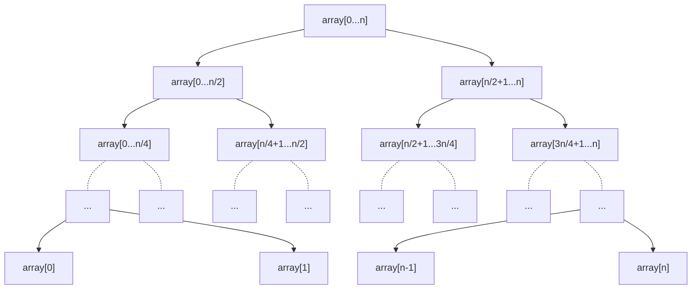

# Segment Tree
Segment trees are a hierarchical data structure (generally stored in [[arrays_1d|arrays]]), to perform range operations ($dq$ and $uq$).

This can be:
$$
f = \left\{\begin{array} { c l }
\sum, & \text{summation}\\
\prod, & \text{product}\\
\bigwedge, & \text{and}\\
\bigvee, & \text{or}\\
\bigoplus, & \text{xor}\\
\min, & \text{min value}\\
\max, & \text{max value}\\
\gcd, & \text{gcd of first numbers}\\
\text{lcm}, & \text{Lowest common Multiple}\\
\vdots
\end{array}\right.
$$

The segment tree is more flexible in range operations considering other data structure, because it does not require any inverse operators.


For example: consider an array $A=\begin{array}{cl}\{12&192&6&60&12&84&300&36&72\}\end{array}$.

To create a segment tree for $\gcd{(a,b)}$, it's equivalent segment tree would look something like:

<table>
	<tr>
		<td colspan="9" class="math display">6\ [0:8]</td>
	</tr>
	<tr>
		<td colspan="5" class="math display">6: A[0:2,7:8]</td>
		<td colspan="4" class="math display">12:\ A[3:6]</td>
	</tr>
	<tr>
		<td colspan="3" class="math display">12:\ A[0,7:8]</td>
		<td colspan="2" class="math display">6:\ A[1:2]</td>
		<td colspan="2" class="math display">12:\ A[3:4]</td>
		<td colspan="2" class="math display">12:\ A[5:6]</td>
	</tr>
	<tr>
		<td colspan="2" class="math display">36:\ A[7:8]</td>
		<td class="math display">12:\ A[0]</td>
		<td class="math display">192:\ A[1]</td>
		<td class="math display">6:\ A[2]</td>
		<td class="math display">60:\ A[3]</td>
		<td class="math display">12:\ A[4]</td>
		<td class="math display">84:\ A[5]</td>
		<td class="math display">300:\ A[6]</td>
	</tr>
	<tr>
		<td class="math display">36:\ A[7]</td>
		<td class="math display">72:\ A[8]</td>
	</tr>
</table>

The values $A[0], A[1],\ldots A[8]$ are the original elements of an array, and the previous elements are made by combining their children via some function (here, $\gcd$).

```ad-note
These are $0$-indexed array, and for traversing, operation differs from $1$ indexed segment tree.
```

## Building Segment Tree $S$
$$
\forall\ x\in\mathbb{N},\ x\leq n-1:\ S_x=f(S_{2x+1}, S_{2x+2})
$$
where function $f(a,b)$ is the function mentioned above.

```python
def build(array: list, combine) -> list:
    """
    Build a segment tree.
    >>> from math import gcd
    >>> build([1, 2, 3, 4, 5, 6, 7, 8], lambda a, b: a + b)
    [36, 10, 26, 3, 7, 11, 15, 1, 2, 3, 4, 5, 6, 7, 8]
    >>> build([1, 2, 3, 4, 5, 6, 7, 8, 9, 10, 11], lambda a, b: a + b)
    [66, 52, 14, 30, 22, 5, 9, 13, 17, 21, 1, 2, 3, 4, 5, 6, 7, 8, 9, 10, 11]
    >>> build([1, 2, 3, 4, 5, 6, 7, 8, 9, 10, 11], lambda a, b: max(a, b))
    [11, 11, 5, 9, 11, 3, 5, 7, 9, 11, 1, 2, 3, 4, 5, 6, 7, 8, 9, 10, 11]
    >>> build([12, 192, 6, 60, 12, 84, 300, 36, 72], lambda a, b: gcd(a, b))
    [6, 6, 12, 12, 6, 12, 12, 36, 12, 192, 6, 60, 12, 84, 300, 36, 72]
    >>> build([12, 192, 6, 60, 12, 84, 300, 36, 72], lambda a, b: a ^ b)
    [494, 166, 328, 96, 198, 48, 376, 108, 12, 192, 6, 60, 12, 84, 300, 36, 72]
    """
    n = len(array)
    seg_tree_array = [0]*(n-1) + list(array)
    for x in range(n-2, -1, -1):
        seg_tree_array[x] = combine(seg_tree_array[(x << 1) + 1], seg_tree_array[(x << 1) + 2])
    return seg_tree_array
```

## Querying ranges $[l,r]$
Query ranges for $A[l\ldots r]$ can be done as follows with $seg$.:
example: for xor operation: 
$A=\begin{array}{cl}\{12&192&6&60&12&84&300&36&72\}\end{array}$.
and $f=\bigoplus\limits_{x=L}^{R}A_x$
$seg(A,\ f)=[494, 184, 328, 96, 216, 48, 376, 108, 12, 192, 24, 60, 12, 84, 300, 36, 72]$.
- Algorithm:
- while $L\leq R$, do:
	- If $L$ is on the right branch of segment tree: then
		- we perform $res=f(res,S_L)$ as resultant value, and we move inwards: to the node which is adjacent to the **right** of it's parent: i.e., $p(L)=\left\lfloor\dfrac{L-1}{2}\right\rfloor, \implies L_{new}=p(L)+1$. This is done because we won't be dealing with any values $<L$ related to direct parent $p[L]$.
		- otherwise, we move to parent $L_{new}=p(L)$.
	- If $R$ is on the left branch of segment tree, then:
		- we perform $res=f(res, S_R)$ as resultant value, and we move inwards to the node which is adjacent to the **left** of it's parent: i.e., $p(R)=\left\lfloor\dfrac{R-1}{2}\right\rfloor, \implies R_{new}=p(R)-1$.
		- otherwise, we move to parent $R_{new}=p(R)$.

```python
def query(seg_tree_array: list, left: int, right: int, n: int, init: int, combine):
    """
    Query on segment tree
    :init is the initial value of result
            
              36
         10         26
      3     7    11    15
    1  2  3  4  5  6  7  8        

    >>> arr = [1, 2, 3, 4, 5, 6, 7, 8]
    >>> sum_f =  lambda a, b: a + b
    >>> seg = build(arr, sum_f)
    >>> seg
    [36, 10, 26, 3, 7, 11, 15, 1, 2, 3, 4, 5, 6, 7, 8]
    >>> query(seg, 2, 5, len(arr), 0, sum_f)
    18
    >>> query(seg, 1, 5, len(arr), 0, sum_f)
    20
    >>> query(seg, 1, 7, len(arr), 0, sum_f)
    35
    >>> query(seg, 0, 5, len(arr), 0, sum_f)
    21
    >>> arr = [12, 192, 6, 60, 12, 84, 300, 36, 72]
    >>> f =  lambda a, b: a ^ b
    >>> seg = build(arr, f)
    >>> seg
    [494, 166, 328, 96, 198, 48, 376, 108, 12, 192, 6, 60, 12, 84, 300, 36, 72]
    >>> query(seg, 2, 5, len(arr), 0, f)
    98
    >>> query(seg, 0, 6, len(arr), 0, f)
    386
    """
    result = init
    left += n-1
    iter = 0
    right += n-1
    while left <= right:
        # print('iter', iter, left, right)
        if not left & 1:
            # print('l', left, seg_tree_array[left])
            result = combine(result, seg_tree_array[left])
            left += 1
        if right & 1:
            # print('r', right, seg_tree_array[right])
            result = combine(result, seg_tree_array[right])
            right -= 1
        left -= 1
        left //= 2
        right -= 1
        right //= 2
        iter += 1
    return result
```

## Single Update Query
Updating a certain position:
$uq = \{(L, R, v):\ L=R, 0 \leq L \leq |A|\}$
We update value $v$ at index $i$ of segment tree $seg$ as:
- while $i\geq0$, do
	- if $i=0$, break the loop
	- update parent of $i$ $\left(p(i)=\left\lfloor\dfrac{i-1}2\right\rfloor\right)$ as:
$$
S_{p(i)}=S_{2i+1}+S_{2i+2}
$$
```python
def update(seg_tree_array: list, n: int, index: int, value: int, combine) -> int:
    """
    Updates the seg tree array
    >>> arr = [12, 192, 6, 60, 12, 84, 300, 36, 72]
    >>> f =  lambda a, b: a ^ b
    >>> seg = build(arr, f)
    >>> seg
    [494, 166, 328, 96, 198, 48, 376, 108, 12, 192, 6, 60, 12, 84, 300, 36, 72]
    >>> query(seg, 2, 5, len(arr), 0, f)
    98
    >>> query(seg, 0, 6, len(arr), 0, f)
    386
    >>> update(seg, len(arr), 2, 24, f)
    >>> seg
    [494, 184, 328, 96, 216, 48, 376, 108, 12, 192, 24, 60, 12, 84, 300, 36, 72]
    >>> query(seg, 0, 6, len(arr), 0, f)
    412
    """
    index += n-1
    seg_tree_array[index] = value
    index -= 1
    index //= 2

    while index >= 0:
        seg_tree_array[index] = combine(seg_tree_array[2*index + 1], seg_tree_array[2*index + 2])
        index -= 1
        index //= 2
        if index == 0:
            break
```
