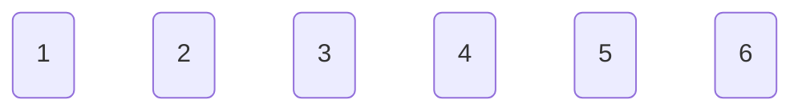
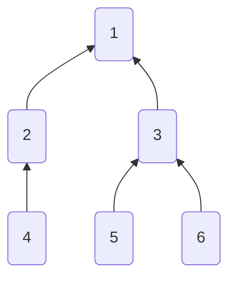
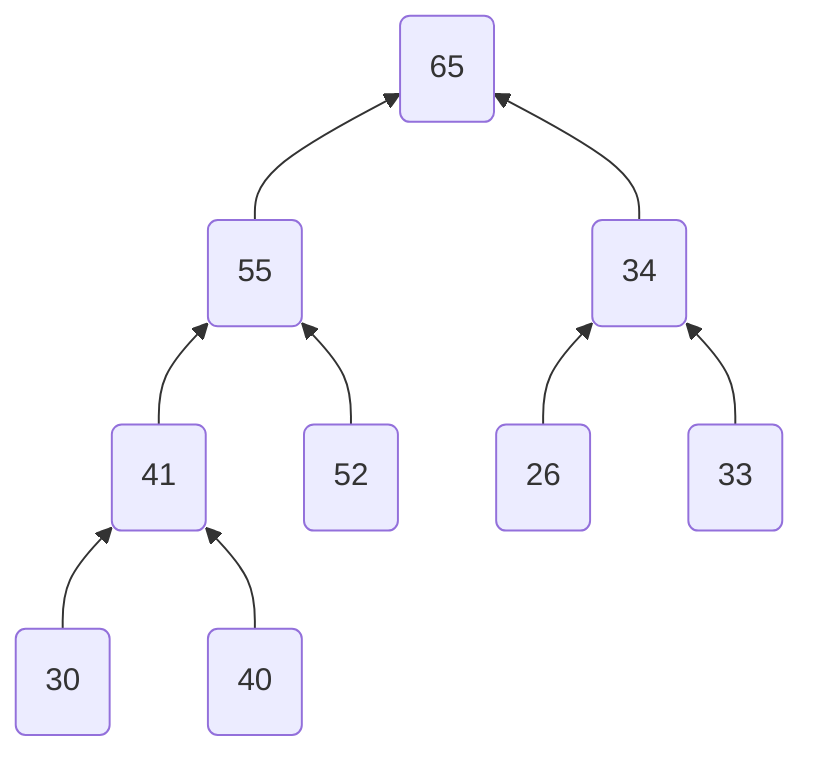

# Playground for Array (note observation)

## Interesting Observations
1. For array of size $n$: reversing window of size $w$ from $i = 0 \rightarrow n - w$ (or from $i = n - w \rightarrow 0$) is the same as rotating array to the left by $w-1$, if $w\equiv 1(\bmod 2)$, otherwise, the last $w - 1$ elements are in reverse order as they were in original array.
	1. An efficient way to rotate an array is to either use [Juggling algorithm](https://www.geeksforgeeks.org/array-rotation/) or use [reversal algorithm](https://www.geeksforgeeks.org/program-for-array-rotation-continued-reversal-algorithm/):
2. For any array $A$:
	1. Total subarrays = $\dfrac{|A|\cdot(|A|+1)}{2}$.
	2. Total subsequences of $A$ i.e, $S(A)=2^{|A|}-1$. (excluding an empty subsequence).

## Various ways of using #arrays (Applications):
### In non-linear fashion.
a. Use to store parent of a vertex (Example in Disjoint Set Union: DSU).

For example, for an array with 6 vertices: $P = \lbrace1,2,3,4,5,6\rbrace$, (a 1-indexed array where the element at $i^{th}$ index defines parent of node $i$) each are linked to itself (we're removing self-links).



After setting $P=\lbrace1,1,1,2,3,3\rbrace$, we get the following graph:



b. As a sequential complete k-ary tree (e.g., trees constructed in binary heaps): 

Given array $A=\lbrace65,55,34,41,52,26,33,30,40\rbrace$, is an example of an [[heaps|max-heap array]]:



The parent of this binary tree at $i^{th}$ index is defined as:

$$
p(i) =\begin{cases}
\left\lfloor\dfrac{i}{2}\right\rfloor,&a\textrm{ is 1-indexed array}\\
\left\lfloor\dfrac{i-1}{2}\right\rfloor,&a\textrm{ is 0-indexed array}
\end{cases}
$$

Childs of a node $i^{th}$ node are $(2i, 2i+1)$ for $1$-indexed array, $(2i+1, 2i+2)$ for $0$-indexed.
Generalizing, replace factor $2$ with $k$ for k-ary tree, also, there would be at most $k$ childs for a node.

```ad-note
This type of value storing is useful iff there is a parent-child relationship (to figure out whether relationship can be used between siblings as well).
```

### In linear fashion

#### Cumulative function

An array with certain values:$A = \lbrace65,55,34,41,52,26,33,30,40\rbrace$

can have a cumulative function (function for first $i$ values in array)

For e.g., for sum of first $n$ number:

$$P(A) = \lbrace65,120,154,195,247, 273, 306, 336, 376\rbrace$$

i.e., 

$$P(A, i) = \sum\limits_{k=0}^{i}A_k.$$

These are called a **prefix sum** (say $P$).
A reverse cumulative sum are used as well certain times:

$$
S(A,i) = \sum\limits_{k=i}^{\text{|A|}}A_k
$$

These are called **suffix sums**. Generalizing this: prefix operations for subsegment $A[0\ldots i]$

$$\text{pf}(A_i) = f(A_0,\ A_1,\ \ldots,\ A_i)$$

and suffix operations for subsegment $A[i\ldots n]$

$$
\text{sf}(A_i) = f(A_i,\ A_{i+1},\ \ldots,\ A_n)
$$

where 

$$
pf=sf=\begin{cases}
\sum, & \text{summation}\\
\prod, & \text{product}\\
\bigwedge, & \text{and}\\
\bigvee, & \text{or}\\
\bigoplus, & \text{xor}\\
\min, & \text{min value}\\
\max, & \text{max value}\\
\gcd, & \text{gcd of first numbers}\\
\text{lcm}, & \text{Lowest common Multiple}\\
\vdots
\end{cases}
$$

To find sub-array values $a[i\ldots j]$, a function should have an inverse operator.
For e.g., For sum of subarray: subtraction is an inverse $-$ operator.

$$
\sum\limits_{k=i}^{j}a_k=\sum\limits_{k=0}^{j}a_k-\sum\limits_{k=0}^{i}a_k
$$

Similarly, for $\prod$, division is the inverse, for $\oplus$ (xor), the inverse is xor operator.
Otherwise, user need to make a work-around/evaluate $f$ for other function everytime.

#### Using two-pointers
- Segregate values: an array:

$$
a = \lbrace65,55,34,41,52,26,33,30,40\rbrace
$$

can be segregated in two parts based on user-condition:

```python
def segregate(arr: list, condition):
    """
    Segregates array based on condition
    >>> segregate([65, 55, 34, 41, 52, 26, 33, 30, 40], lambda x: x % 2 == 0) # split even and odd numbers
    [40, 30, 34, 26, 52, 41, 33, 55, 65]
    >>> segregate([65, 55, 34, 41, 52, 26, 33, 30, 40], lambda x: x % 5 == 0) # split divisors of 5
    [65, 55, 40, 30, 52, 26, 33, 41, 34]
    """
    if condition is None:
        raise Exception('No proper condition defined')
    i, j = 0, len(arr) - 1
    while i < j:
        while i < j and condition(arr[i]): i += 1
        while i < j and not condition(arr[j]): j -= 1
        arr[i], arr[j] = arr[j], arr[i] # edge case: i = j, but still works out.
    return arr
```

```ad-note
The path of $i$ is taken from array starting element, moving forward and $j$ from array last element and moving backwards (for spliting array into half based on condition). This path traversal can be defined as per user. i.e., $i$ and $j$ can be also traversed in even and odd indices respectively of an array, or a certain path that should follow a condition as per users intention.
```

- Sliding window:
	- [ ] To do.

#### Stacks
[[stack|See stack implementation]]

### For solving range queries faster.

The queries for an array are as defined as display $dq$ and update queries $uq$ (modification of a value).

$$
\begin{matrix}
\textrm{dq} &=& \{(L,R):L,R \in \mathbb{W},\ 0\leq L<R\leq |a|\} \\
\textrm{uq} &=& \{(L,R,\textrm{value}):L,R \in \mathbb{W},\ 0\leq L\leq R\leq |a|\} \\
\textrm{q}&=&(\textrm{dq}\ \cup\ \textrm{uq})
\end{matrix}
$$

#### $sqrt$ Decomposition
A basic idea of sqrt decomposition for array of size $n$ is to combine the results of $\sqrt{n}$ blocks in an array of size $\sqrt n$.

1. Pre-processing.
The below e.g. are for sum and min function, although the reduce function `q_function` or $Q$ can be different, with parameter as sub-array:

$$
Q =
\begin{cases}
\gcd(a_L,\ a_{L+1},\ \ldots,\ a_R),\\
\max(a_L,\ a_{L+1},\ \ldots,\ a_R),\\
\min(a_L,\ a_{L+1},\ \ldots,\ a_R),\\
\sum\limits_{i=L}^{R}a_i,\\
\prod\limits_{i=L}^{R}a_i,\\
\bigoplus\limits_{i=L}^{R}a_i, & \text{xor operation}\\
\vdots
\end{cases}
$$

Here, $a\oplus b\equiv a\textrm{ xor }b$.

```python
def preprocess(array: list, q_function) -> list:
    """
    Preprocesses the array such that for size n, we get sqrt(n)
    pre-processed array
    >>> preprocess([1, 2, 3, 4, 5, 6, 7, 8, 9, 10, 11, 12, 13, 14, 15, 16], sum)
    [10, 26, 42, 58]
    >>> preprocess([15, 23, 31, 45, 5, 36, 97, 28, 49, 110, 11, 52, 213, 14, 1, 10, 171, 41, 91, 21, 32, \
        232, 233, 111, 34, 24, 227, 81], min)
    [5, 28, 1, 10, 32, 24]
    """
    n = len(array)
    sqrt_array_len = int(sqrt(n))
    loop = sqrt_array_len + (0 if (floor(sqrt(n)) == sqrt(n)) else 1)
    return [q_function(array[ i * sqrt_array_len : min((i + 1) * sqrt_array_len, n)]) for i in range(loop)]
```

2. To display the range queries:

```python
def sqrt_decomposition_solve_queries(array: list, queries: list, q_function) -> list:
    """
    Solves the queries using sqrt_decomposition.
    >>> a = [1, 2, 3, 4, 5, 6, 7, 8, 9, 10, 11, 12, 13, 14, 15, 16]
    >>> q_function = sum
    >>> queries = [[0, 10], [1, 3], [2, 15], [0, 16]]
    >>> sqrt_decomposition_solve_queries(a, queries, q_function)
    [55, 5, 117, 136]
    >>> a = [15, 23, 31, 45, 5, 28, 97, 36, 49, 110, 11, 52, 213, 14, 1, 10, 171, 41, 91, 21, 32, \
        232, 233, 111, 34, 24, 227, 81]
    >>> q_function = min
    >>> queries = [[0, 10], [1, 3], [2, 15], [0, 16], [21, 26], [5, 10]]
    >>> sqrt_decomposition_solve_queries(a, queries, q_function)
    [5, 23, 1, 1, 24, 28]
    """
    sqrt_array = preprocess(array, q_function)
    query_answers = []

    length = len(sqrt_array)
    is_perfect_sq = len(array) == len(sqrt_array) * len(sqrt_array)
    actual_sqrt = length if is_perfect_sq else length - 1

    for left, right in queries:
        sleft, sright = left // actual_sqrt, right // actual_sqrt
        # in the same sqrt block
        if sleft == sright:    
            query_answers.append(q_function(array[left:right]))
        # in different sqrt block
        else:
            value = None
            # left is not a perfect multiple of actual_sqrt
            # cannot be captured by sqrt block, so have to access part of array.
            if sleft * actual_sqrt < left:
            # complexity O(sqrt(n))
                value = q_function(array[left:(sleft+1)*actual_sqrt])
                sleft += 1          # skip this block since we considered it.

            # right is not a perfect multiple of actual_sqrt
            # cannot be captured by sqrt block, so have to access part of array again
            # complexity O(sqrt(n))
            if sright * actual_sqrt < right:
                if value is not None:
                    value = q_function([value, q_function(array[sright*actual_sqrt:right])])
                else:
                    value = q_function(array[sright*actual_sqrt:right])
            
            # Capture remaining by sqrt_array
            if sleft < sright:
                if value is not None:
                    value = q_function([value, q_function(sqrt_array[sleft:sright])]) #
                else:
                    value = q_function(sqrt_array[sleft:sright])
            query_answers.append(value)
    return query_answers
```

3. Update queries:
	 if for `q_function`, `q_function_inverse` exists for an element, then update query will takes $O(1)$, since `sqrt_array` has already computed the results, and having inverse operator to replace with different value will be quick. Otherwise a whole $\sqrt{n}$ block has to be processed again (for e.g., replacing for $\min$,  $\max$, $\gcd$, $lcm$, and other operations), which takes $O(\sqrt{n}$).
	 e.g., inverse operator for
	 - adding ($\text{sum}+a$) is subtracting ($\text{sum}-a$), 
	 - $prod \times a$  is $\dfrac{prod}{a}$
	 - inverse of $a\oplus b$ is $a\oplus b$ itself.
- [ ] To do: code.

#### MO's algorithm
MO's algorithm helps by pre-processing queries => this is a offline range query solver.
- [ ] To do

#### [[fenwick_trees_1|Fenwick trees]]
- [ ] To do

#### [[segment_tree_1|Segment Tree]]
- [ ] Done 

#### Difference Array
For certain problem that contains range update queries ($uq$) only, and finding the resultant array after making such modifications, difference array are very effective.

Some of the operations that are straightforward include:

$$
\forall\ i\in[L,\ R],\ \ 
f(a_i) = \begin{cases}
k + a_i, & \text{summation}\\
k \times a_i, & \text{product}\\
\bigoplus, & \text{xor}\\
\vdots
\end{cases}
$$

These above operations works because after each of these operators have a inverse operator.

To update the difference array (say $da$ for array $a$, we perform)

$$\begin{array}{c l}da_L=f(a_i), & da_R = f^{-1}(a_i)\end{array}$$

```python
def difference_array_queries(array: list, diff_array: list, queries: list, operation, inv_operation) -> list:
    """
    Apply difference array queries to a empty array, so that 
    while display the results are shown with the changes
    (queries would be a tuple of left, right and value to change)

    diff_array is initalized as a pair of zeroes.

    >>> array = [1] * (25)
    >>> array
    [1, 1, 1, 1, 1, 1, 1, 1, 1, 1, 1, 1, 1, 1, 1, 1, 1, 1, 1, 1, 1, 1, 1, 1, 1]
    >>> diff_array = [(0, 0)] * (25)
    >>> queries = [(1, 5, 2), (2, 6, 5), (12, 16, 10), (23, 24, 3)]
    >>> operation = lambda add_to, add_by: add_to + add_by
    >>> inv_operation = lambda add_to, add_by: add_to - add_by
    >>> difference_array_queries(array, diff_array, queries, operation, inv_operation)
    [1, 3, 8, 8, 8, 8, 6, 1, 1, 1, 1, 1, 11, 11, 11, 11, 11, 1, 1, 1, 1, 1, 1, 4, 4]

    >>> array = [2] * 12 + [3] * 13
    >>> diff_array = [(1, 1)] * (25)
    >>> queries = [(1, 5, 2), (2, 8, 5), (3, 16, 10), (23, 24, 3)]
    >>> operation = lambda multiply_to, multiply_by: multiply_to * multiply_by
    >>> inv_operation = lambda divide_to, divide_by: divide_to // divide_by
    >>> difference_array_queries(array, diff_array, queries, operation, inv_operation)
    [2, 4, 20, 200, 200, 200, 100, 100, 100, 20, 20, 20, 30, 30, 30, 30, 30, 3, 3, 3, 3, 3, 3, 9, 9]

    >>> array = [2] * 12 + [3] * 13
    >>> array
    [2, 2, 2, 2, 2, 2, 2, 2, 2, 2, 2, 2, 3, 3, 3, 3, 3, 3, 3, 3, 3, 3, 3, 3, 3]
    >>> diff_array = [(0, 0)] * (25)
    >>> queries = [(1, 5, 2), (2, 8, 5), (3, 16, 10), (23, 24, 3)]
    >>> operation = lambda xor1, xor2: xor1 ^ xor2
    >>> difference_array_queries(array, diff_array, queries, operation, operation)
    [2, 0, 5, 15, 15, 15, 13, 13, 13, 8, 8, 8, 9, 9, 9, 9, 9, 3, 3, 3, 3, 3, 3, 0, 0]
    """
    initial_values = diff_array[0]
    for L, R, value in queries:
        diff_array[L] = (operation(diff_array[L][0], value), diff_array[L][1]) if diff_array[L][0] else (value, diff_array[L][1])
        diff_array[R] = (diff_array[R][0], operation(diff_array[R][1], value)) if diff_array[R][1] else (diff_array[R][0], value)

    result = []
    value = initial_values[0]
    for index, values in enumerate(diff_array):
        if values[0] != 0:
            value = operation(value, values[0])
        result.append(operation(array[index], value))
        if values[1] != 0:
            value = inv_operation(value, values[1])

    return result
```

The complexity is $O(q+n)$, where $q$: number of queries and $n$: list size.

For operation $\bigwedge$ (bitwise-and) operator and $\bigvee$ (bitwise-xor) operator, certain adjustments can be made.

##### Difference Array for $\bigvee$ operator
For bitwise-xor, it is easy: we create a difference array as array of bitset (for $32$-bit integer, the shape of array would be $n\times 32$), and increment the values of their bits on $L$ and $R$ index in array $da$.

While constructing the resultant array, we perform this check:
- If any one of the $i^{th}$ bit is $> 0$, then we set this bit in the integer, (bitwise-or follows union of all the bits for $k$ integers).

##### Difference Array for $\bigwedge$ operator
For bitwise-and, the idea of creating difference array is the same as [[arrays_1d#Difference Array for bigvee operator|xor]], but an additional information is needed: we need to know how many elements are being **ANDed** (the value $k$ for index $i$ in expression $a_i \wedge v_1\wedge v_2 \wedge \cdots \wedge v_k$).
For value $a_i$, we'll have stored bits in 2-D array $B_{ij}$, that denotes $j^{th}$ bit of $i^{th}$ integer.

While constructing the resultant array, we perform the check:
- If the bits set is equal to the number $k$, then we set this bit in the integer. (and operation follows intersection of bits for $k$ integers).

The below operation uses range from $[l,r)$ (excluding $r$). Though this can be easily adjusted by increasing `bit_set` array (i.e., $B$) by 1 and performing `set_bits(bits_set[R+1], value, True); integers_added[R+1] += 1` instead of  `set_bits(bits_set[R], value, True); integers_added[R] += 1` 

```python
def difference_array_and_queries(array: list, queries: list) -> list:
    """
    Difference array for bitwise AND operator
    >>> array = [25] * 12 + [31] * 13
    >>> queries = [(1, 5, 21), (2, 8, 15), (3, 16, 10), (23, 24, 23)]
    >>> difference_array_and_queries(array, queries)
    [25, 17, 1, 0, 0, 8, 8, 8, 8, 8, 8, 8, 10, 10, 10, 10, 31, 31, 31, 31, 31, 31, 31, 23, 31]
    """
    def set_bits(bit_set_list: list, value: int, sub: bool) -> None:
        """
        Increase the count of bits that occur in value integer

        These are stored in bit_set_list at a particular index.
        """
        arr = []
        while value > 0:
            arr.append(value & 1)
            value >>= 1
        lenarray = len(arr)
        # Add remaining bits to the array
        arr.extend([0]*(32 - lenarray))
        if not sub:
            for x in range(32):
                bit_set_list[x] += arr[x]
        else:
            for x in range(32):
                bit_set_list[x] -= arr[x]
    
    def construct_bits(total_integers: int, current_bits_set: list, bits_set: list) -> int:
        """
        Construct integer from current bits set. 

        Checks whether total_integers that are ANDed with 
        the array is the same as current_bits_set and sets those
        bits accordingly.
        """
        integer = 0
        for index in range(32):
            current_bits_set[index] += bits_set[index]
        for index in range(31, -1, -1):
            integer <<= 1
            if current_bits_set[index] == total_integers:
                integer ^= 1
        return integer
    # Set bits take O(logn) time
    # Construct bits takes O(logn) time

    # assuming the integer bit-size is 32
    bits_set = [[0]*32 for i in range(len(array))]
    
    integers_added = [0]*len(array)
    # This takes O(q.log(max(value))) time
    for L, R, value in queries:
        set_bits(bits_set[L], value, False)
        integers_added[L] += 1
        set_bits(bits_set[R], value, True)
        integers_added[R] -= 1

    # This takes (O(n.log(max(value)))) time
    result = []
    current_bits_set = [0]*32
    total_integers = 0
    for index, values in enumerate(integers_added):
        total_integers += values
        integer = construct_bits(total_integers, current_bits_set, bits_set[index])
        result.append(array[index] & integer)
    # return 0
    return result
```

The complexity of these operations is $O(q\cdot \log_2{32} + n\cdot \log_2{32})=O(q + n)$. These operations are definetly slower than the first ones, due to bit operations.

If the bits size is varying, then the time complexity turns out to be $O(q\cdot \log_2{(m)}+n\cdot \log_2{(m)})$, where $m$ is max value in update query list $uq$ or in array $a$.
