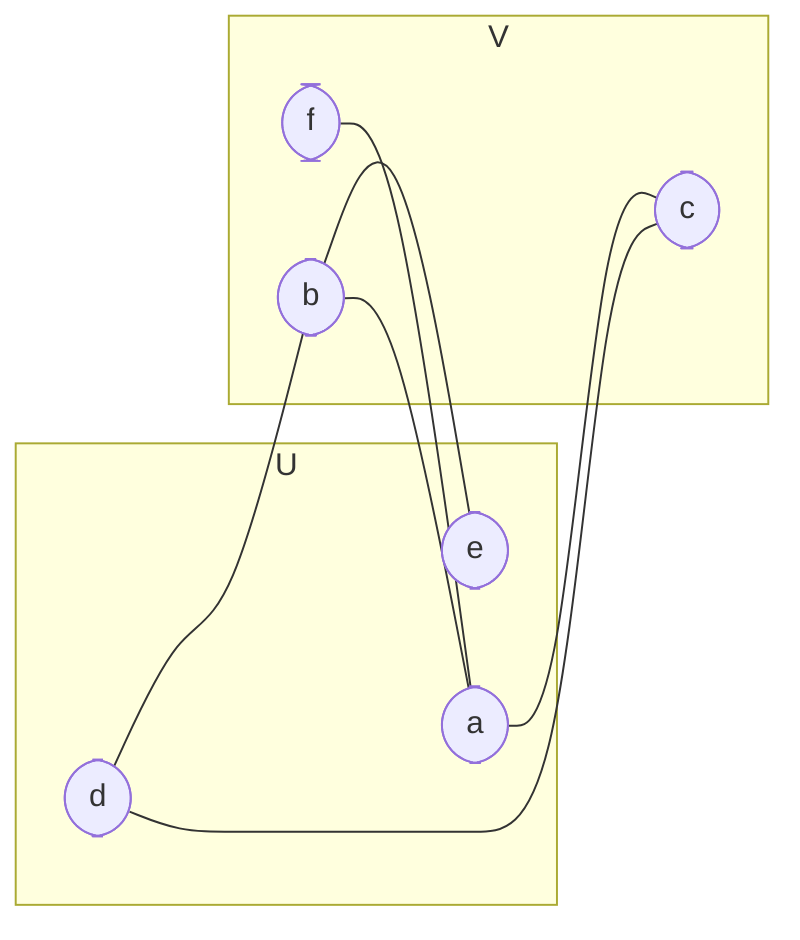

# Graphs
Graphs are a form of info that are denoted by connection between data (edge set $E$) and the data itself (vertices set $V$)

$$
\begin{matrix}
G=(E, V)\\
E=\{(x,y,w): x,y\in V,\ w\in \mathbb{R}\}
\end{matrix}
$$
when $x=y$, it's a self-loop. (We'll keep it aside for now).

# Representing the Graph
## Matrix
A matrix can be denoted as 2D grid as mentioned below.
$$
\begin{matrix}
\frac{v\rightarrow}{v\downarrow}&|& 1 & 2 & 3 & 4 & 5 & 6 & 7\\
-&|& - & - & - & - & - & - & - \\
1&|& 0 & 1 & 0 & 4 & 0 & 5 & 0\\
2&|& 1 & 0 & 4 & 2 & 9 & 0 & 7\\
3&|& 0 & 4 & 0 & 0 & 6 & 1 & 3\\
4&|& 4 & 2 & 0 & 0 & 8 & 0 & 0\\
5&|& 0 & 9 & 6 & 8 & 0 & 2 & 6\\
6&|& 5 & 0 & 1 & 0 & 2 & 0 & 11\\
7&|& 0 & 7 & 3 & 0 & 6 & 11 & 0\\
\end{matrix}
$$
This graph would look something like:


A bi-directional graph $\implies$ symmetry in a matrix
## Adjacency Matrix.
List is maintained of the connections. The adjacent matrix for above graph:

$$
\begin{matrix}
1 \implies (2,1) & (4,4) & (6,5)\\
2 \implies (1,1) & (3,4) & (4,2) & (5,9) & (7,7)\\
3 \implies (2,4) & (5,6) & (6,1) & (7,3)\\
4 \implies (1,4) & (2,2) & (5,8)\\
5 \implies (2,9) & (3,6) & (4,8) & (6,2) & (7,3)\\
6 \implies (1,5) & (3,1) & (5,2) & (7,11)\\
7 \implies (2,7) & (3,3) & (5,6) & (6,11)
\end{matrix}
$$

## Sparse Matrix
Keeps only edge information. for e.g., $n=7$
$$
\begin{bmatrix}
u & v & w\\
1 & 2 & 4\\
2 & 5 & 6\\
3 & 4 & 2\\
6 & 7 & 9\\
4 & 6 & 2\\
1 & 6 & 7
\end{bmatrix}
$$


This is an example of a [[trees|tree]].

### Degree of a vertex.
1. Degree $D(u)$: for an undirected graph $G$, degree of vertex $u$ is defined as $|\{x: (x,y)\in E,\  (x=u)\ \vee\ (y=u)\}|$, i.e., number of different vertices connected to $u$ in set of $E$.

# Types of graphs

## Bi-partite graphs
Bi-partitie graphs are such graphs that can be divided into 2 independent sets $U$ and $V$.

Each of the vertex in either of these set has at least one vertex connected to the other set. It also implies the graphs having no odd cycles (in a cycle, count of vertices should be even).



It's easy to check whether the graph is bi-partitie or not. Starting from $c=0$, we assign a node a value $c$ and it's neighboring unvisited nodes $1-c$. If the visited neighbor has same color as the current vertex, then the graph is not bi-partite.

```python
def is_bipartite(graph: list[list[int]]) -> bool:
    """
    Checks whether the given graph is bi-partite
    i.e., two colorable graph
    Input is an adjacent graph.
    """
    n = len(graph)
    # Color array set for each of the vertices
    colors = [-1]*n
    for x in range(n):
        # If the vertex is not marked as visited
        if colors[x] == -1:
            # we traverse through vertex x and it's neighbors
            stack = [(x, 0)]
            while stack:
                v, c = stack.pop()
                # Assign the color to the vertex
                colors[v] = c
                # Neighbors should be marked as different colors
                for next_v in graph[v]:
                    # If not visited, then assign the next color
                    if colors[next_v] == -1:
                        stack.append([next_v, 1-c])
                    # If the color is the same as the current vertex, then
                    # this graph cannot be divided into two values.
                    # Return false.
                    elif colors[next_v] == c:
                        return False
    # If each vertex are colored, then
    # return true
    return True
```

Complexity for this algorithm is $O(|V|+|E|)$, since each vertices are visited and are assigned colors, similarly, each of the edges are considered while traversing the graph.

## Applications:
- These are used in [factor graph](https://en.wikipedia.org/wiki/Factor_graph), which are used in [[probability]] theory.
These are extensively used in decoding codewords.


## [[trees]]
A special type of graph. Click the title for more details.

## [[graphs_1#Matrix|Undirected Graphs]]
Definition, $\forall (u,v)$, if $u$ and $v$ are connected and $(u,v)\in E$, then they can be travelled to-and-from these vertex. The link shows undirected graph storage.

Undirected graphs makes a symmetrical matrix representation.

## Regular Graphs
Regular graphs are defined as graph constructed such that 
$$
\forall\ u\in V, D(u)=x,\ x \in N,\ x\leq|V|-1
$$
(i.e., graphs in which each vertex has same degree of connectivity.)

## Connected Graphs
If the graphs has at least one path from each pair $u$ and $v$ in graph $G$, then the graph $G$ is complete.
$$
\therefore\ \forall\ (u,v),\ u\in V,v\in V,\ u\neq v,\ |P(u,v)|\geq1
$$
where $P(u,v)$ is a set of paths from vertex $u$ to $v$ and $|P(u,v)|$ is number of paths for the same.

## Weighted Graph
A weighted graph is defined as set of edges with a certain value assigned $E=\{(u,v,w): u\in V, v\in V, w \in \mathbb{R}\}$. 

Mostly we denote it as weight or cost of that edge (in Prim/Kruskal and Djikstra, we use them to minimize tree cost/distance between two vertices respectively). 

One famous problem: [[np-hard|Travelling Salesman Problem]] also uses weighted graph to determine smallest weight sum.

# Searching Graphs
## [[searching|Depth First Search]].
- [x] Code: Done
- [x] Explaination: Done

### Combining results using DFS.
There are a lot of instances where we want to return to a visited vertex and combine the results based on their neighboring vertices.

In a graph $G=(E,V)$, the steps to do so for each vertex $v$ till stack $S$ is empty:
- pop vertex $v$ from $S$
- If vertex $v$ is already visited before, then:
	- perform $f(v_{n1}, v_{n2}, \ldots)$, where $v_{n1}, v_{n2}, \ldots$ are adjacent vertices of $v$, to combine the values.
- else:
	- we just visit this vertex $v$, mark it as visited.
	- push $v$ first on $S$: and then the neighboring values in $S$.

```python
def depth_first_search_with_combine(adj_matrix: list, start_vertex: int, combine, depth_first_condition, init):
    """
    Perform depth first search and combine the results as well.
    >>> 
    """
    visited = { key: False for key in adj_matrix.items() }
    result = { key: init for key in adj_matrix.items() }

    stack = [start_vertex]
    while stack:
        vertex = stack.pop()
        if visited[vertex]:
            for next_vertex in adj_matrix[vertex]:
                # Depending on the use case, user can either
                # combine result of current and neighboring vertex with the 
                # help of precomputed results stored in result, and can just 
                # return vertex if condition is not satisfied.
                result[vertex] = combine(vertex, next_vertex, result)
            
        else:
            visited[vertex] = True
            # Required. since to combine the results, user has to come
            # back to this vertex. So we push this current vertex first.
            stack.push(vertex)
            # and then add subsequent vertices next.
            stack.extend([next_vertex for next_vertex in adj_matrix[vertex] \
                            if depth_first_condition(vertex, next_vertex)])
    
    return result[start_vertex]
```

Complexity: The complexity is $O(|V|+|E|)$: We visit a vertex only $2$ time. 
The first one for $v$ is when:
- We end up via another neighbor of $v$ or
- We start from the vertex $v$
And the second visit is when we pop visited vertex $v$ from stack. This makes $O(|V|)$ plus we perform check on each edge to see other vertices which is $O(|E|)$.

## [[searching#Breadth First Search|Breadth First Search]]
- [x] Code: Done
- [x] Explaination: Done


# Minimum Spanning Tree.
## Kruskal's Algorithm
This algorithm constructs the tree with minimum weight sum, from a given graph. It greedily chooses the edges from set of edges $E$, and then check for potential cycle generation in a graph $G$. This can be checked with Disjoint Set Union.

i.e., considering $E=\{(u_i,v_i,w_i):u,v\in V,\ \forall\ i\in [1,|E|-1],\ w_i<w_{i+1}\}$, (i.e., weights $E$ are in sorted order) Kruskal'a algorithm is implemented below.

```python
def kruskal_minimum_spanning_tree(edges_info: list, total_vertices: int):
    """
    Returns the minimum MST graphs
    >>> edges = [(0, 1, 10), (0, 2, 6), (0, 3, 5), (1, 3, 15), (2, 3, 4)]
    >>> kruskal_minimum_spanning_tree(edges, 4)
    (19, [(2, 3, 4), (0, 3, 5), (0, 1, 10)])
    >>> edges = [(1, 6, 10), (1, 2, 28), (2, 7, 14), (7, 5, 24), (7, 4, 18), (5, 4, 22), (3, 4, 12), (2, 3, 16), (5, 6, 25)]
    >>> kruskal_minimum_spanning_tree(edges, 7)
    (99, [(1, 6, 10), (3, 4, 12), (2, 7, 14), (2, 3, 16), (5, 4, 22), (5, 6, 25)])
    """
    def initialize(set_size: int) -> list:
        """
        Initialize the parent vertex to itself.

        e.g.,
        ```
        [1]     [2]     [3]     [4]

        parent_list = [0, 1, 2, 3, 4]
        ```
        """
        return [ vertex for vertex in range(set_size + 1) ]

    def find_parent(parent_list: list, vertex: int) -> int:
        """
        Find the parent of the current vertex, that are linked via
        union function or are already linked.

        ```
        e.g.,
        [1]         [4]
        |
        [2]
        |
        [3]

        => parent_list = [0, 1, 1, 2, 4]
        ```

        - find_parent(parent_list, 3) will modify the parent_list to

        ```
        [1] - [3]        [4]
        |
        [2]

        => parent_list = [0, 1, 1, 1, 4]
        ```
        >>> find_parent([0, 1, 1, 2, 4], 3)
        1
        """
        if parent_list[vertex] == vertex:
            return vertex
        parent_list[vertex] = find_parent(parent_list, parent_list[vertex])
        return parent_list[vertex]

    def union(parent_list: list, first_vertex: int, second_vertex: int) -> None:
        """
        Find the disjoint sets and join their parents.

        ```
        e.g.,
        [1] - [3]         [4] - [5] - [6] 
        |
        [2]

        => parent_list = [0, 1, 1, 2, 4, 4, 5]
        ```

        - union(parent_list, 3, 6) will modify the parent_list to

        ```
                [4] - [6]
                /   \\
        [3] - [1]     [5]
            |
            [2]

        => parent_list = [0, 4, 1, 1, 4, 4, 4]
        ```
        >>> parent_list = [0, 1, 1, 2, 4, 4, 5]; union(parent_list, 3, 6); parent_list
        [0, 4, 1, 1, 4, 4, 4]
        """
        first_vertex, second_vertex = find_parent(parent_list, first_vertex), find_parent(parent_list, second_vertex)
        if first_vertex != second_vertex:
            parent_list[first_vertex] = parent_list[second_vertex]

    edges_info.sort(key=lambda x: x[2])
    parent = initialize(total_vertices)
    pairs, index, minimum_weight = [], 0, 0
    while index < len(edges_info) and len(pairs) < total_vertices:
        first_v, second_v, weight = edges_info[index]
        index += 1
        parent_first_v, parent_second_v = find_parent(parent, first_v), find_parent(parent, second_v)
        # Check whether the vertices have the same parent,
        # if they have, then we're avoiding linking, since, 
        # since they have a common parent, we're essentially closing the
        # endpoint to create a cycle, which is not possible since
        # this is a Tree (MST to be specific)
        if parent_first_v != parent_second_v:
            union(parent, parent_first_v, parent_second_v)
            pairs.append((first_v, second_v, weight))
            minimum_weight += weight

    if len(pairs) != total_vertices - 1:
        return None, None
    return minimum_weight, pairs
```

An alternative to python: C++ code:

```cpp
#include <bits/stdc++.h>
/**
 * @brief Construct a new pair<int, vector<int>>kruskal minimum spanning tree object
 * 
 * @param edges list of edges
 * @returns pair of integer (minimum weight) and list of edges, denoting
 * minimum spanning tree of a given graph.
 */
pair<int, vector<tuple<int, int, int>>> 
    kruskal_minimum_spanning_tree(vector<tuple<int, int, int>>&edges, 
                                  int total_vertices) {
    // sort the list in ascending order of their weights.
    using Edge = tuple<int, int, int>;
    sort(begin(edges), end(edges), [](const Edge&first, const Edge&second) {
        return get<2>(first) < get<2>(second);
    });

    // Find parent of a vertex, and assign the chain to the first parent.
    function<int(vector<int>&, int)>find_parent = 
        [&find_parent](vector<int>&parent, int vertex) {
        if (parent[vertex] != vertex) {
            parent[vertex] = find_parent(parent, parent[vertex]);
        }
        return parent[vertex];
    };

    // Link the parent of first and second vertex. A union operation
    function<void(vector<int>&, int, int)>un = 
        [&find_parent](vector<int>&parent, int f_vertex, int s_vertex) {
        int parent_first_vertex = find_parent(parent, f_vertex);
        int parent_second_vertex = find_parent(parent, s_vertex);
        if (parent_first_vertex != parent_second_vertex) {
            parent[parent_first_vertex] = parent_second_vertex;
        }
    };

    int minimum_weight = 0;
    vector<Edge>tree;
    vector<int>parent(total_vertices + 1, 0);
    for (int i = 1; i <= total_vertices; ++i) {
        parent[i] = i;
    }

    int i = 0;
    while(i < edges.size() && tree.size() < total_vertices - 1) {
        auto [u, v, w] = edges[i++];
        int pu = find_parent(parent, u), pv = find_parent(parent, v);
        if (pu != pv) {
            un(parent, pu, pv);
            tree.push_back(make_tuple(u, v, w));
            minimum_weight += w;
        }
    }

    return {minimum_weight, tree};
}

int main () {
    int u, v, w, n, m;
    cin >> n >> m;
    vector<tuple<int, int, int>>ed;
    for (int i = 0; i < m; ++i) {
        cin >> u >> v >> w;
        ed.push_back(make_tuple(u, v, w));
    }
    auto [weight, tree] = kruskal_minimum_spanning_tree(ed, n);
    cout << weight << endl;
}
```

The overall complexity for the problem:
- First, we sort the edges: this takes $O(|E|\cdot \log_2|E|)$.
- Secondly, for each edge $\in\ E$, we check for the cycle: this is stored in Disjoint Set Union DS, containing all the vertices set $V$. The complexity here is $O(|E|\cdot \log_2|V|)$.
The overall complexity: $O(|E|\cdot \log_2|E|+|E|\cdot \log_2|V|)$.

We can see that the Kruskal traverses along the set of edges $E$. $\implies$ for denser graphs, $|E|\approx|V|^2$. So, Kruskal is ideal when graph is sparse, otherwise the complexity would turn to be $O(|V|^2\cdot \log_2|V|)$.

**Also,** python code does not work for large data (Don't know why). C++ code is faster and efficient here.

### Why greedy approach works here?
Assume that the $T_K=(E_K,V)$ being the set of edges of MST via Kruskal's algorithm, and $T=(E,V)$ is an actual minimum spanning.

We're making clear that $E_K$ and $E$ are different sets, i.e., $\exists\ e\in E_K, e\notin E$. If that's the case, then for vertices $u,v$ in $e=(u,v,w)$, there exists another path from $u,v$ in $E$.

By observation, in graph $T$, there **should** exists at least one edge $e_l$ in the path from $u\rightarrow v$ where $w>w_l$: otherwise Kruskal's algorithm would've considered each of these edges and dealt with them since the edges are sorted in ascending order.

## Prim's algorithm
Prim's algorithm is another way of constructing MST graphs. But the approach is different in this case: we look at the set of vertices $V$, and we look at the nearest vertices to the current vertex $v$.

Prim's algorithm keeps track of an edge, having lowest cost by storing in a [[heaps|heap]] (say $H$). The basic algorithm states:
- Choose an arbitrary vertex $v$. Let the total cost be $C$ (start at $0$).
- While all the vertices are visited (say visited are in set $V_s$), perform the operations:
	- Pop tuple $[u,v,w]$ from heap $H$.
	- Check if $v\in V_s$, if it is, then discard it: otherwise:
		- Include $v$ in $V_s$.
		- add $w$ into $C$
		- $\forall\ u_v, (v, u_v, w_v)\in E$: perform: ($u_v,w_v$ subscript denotes they are neighboring values of $v$).
			- insert $(v,u_v,w_v)$ in $H$ if $u_v\notin V_s$.

```python
def prims_algorithm(adj_matrix: list, start_vertex: int, total_vertices: int):
    """
    Finds the MST by using Prim's method.
    Uses the adjacency matrix and heap to construct MST
    >>> adj = [[(1, 10), (2, 6), (3, 5)], [(0, 10), (3, 15)], [(0, 6), (3, 4)], [(0, 5), (2, 4)]]
    >>> prims_algorithm(adj, 0, 4)
    (19, [(0, 3, 5), (3, 2, 4), (0, 1, 10)])
    >>> # edges = [(1, 6, 10), (1, 2, 28), (2, 7, 14), (7, 5, 24), (7, 4, 18), (5, 4, 22), (3, 4, 12), (2, 3, 16), (5, 6, 25)]
    >>> adj = [[], [(6, 10), (2, 28)], [(7, 14), (1, 28), (3, 16)], [(4, 12), (2, 16)], [(7, 18), (3, 12)], [(7, 24), (4, 22), (6, 25)], [(1, 10), (5, 25)], [(2, 14), (5, 24), (4, 18)]]
    >>> prims_algorithm(adj, 1, 8)
    (99, [(1, 6, 10), (6, 5, 25), (5, 4, 22), (4, 3, 12), (3, 2, 16), (2, 7, 14)])
    """
    class heap:
        """
        Generalize binary heap, arranges elements according to the 
        comparison operator, by default initializes max heap.
        """
        def __init__(self, comparison_operator=None):
            self.heap_array = []
            if comparison_operator is not None:
                self.comparison_operator = comparison_operator
            else:
                # default max heap
                self.comparison_operator = lambda root, child: root >= child

        def push(self, item):
            """
            Pushes an element `item` into the heap.
            """
            # subsituting references for high performance
            ha, co = self.heap_array, self.comparison_operator
            ha.append(item)
            last_index = len(ha) - 1
            # rearrange the added element such the parent-children condition should be satisfied.
            # so swap until the parent-child is not satisfied.
            while last_index and not(co(ha[(last_index - 1) // 2], ha[last_index])):
                ha[last_index], ha[(last_index - 1)//2] = ha[(last_index - 1)//2], ha[last_index]
                last_index = (last_index - 1) // 2

        def heapify(self):
            """
            Used after popping off element from the heap.
            Rearrangement is done when a last element in the heap is put at the 
            top of the heap.

            Swapping is done in this stage, until the heap stage is satisfied:
            - A child is selected that can be the parent of root and another sibling
            - Swap these elements.
            - Repeat this process till such child is not found, or the root element follows
            condition.
            """
            i = 0
            # substitution for better performance
            ha, co = self.heap_array, self.comparison_operator
            # Follow this condition till the last of heap.
            while 2*i + 1 < len(ha):
                left, right = 2 * i + 1, 2 * i + 2
                # if there is no right child.
                if right == len(ha):
                    if not(co(ha[i], ha[left])):
                        ha[i], ha[left] = ha[left], ha[i]
                        i = left
                    else:
                        break
                elif right < len(ha):
                    # check whether 'left' is correct for both root and
                    # sibling
                    if co(ha[left], ha[right]):
                        if not(co(ha[i], ha[left])):
                            ha[i], ha[left] = ha[left], ha[i]
                            i = left
                        else:
                            break
                    elif not(co(ha[i], ha[right])):
                        ha[i], ha[right] = ha[right], ha[i]
                        i = right
                    else:
                        break
                else:
                    break

        def pop(self):
            """
            Pop element from heap: rearranges all element according to the comparator 
            """
            if len(self.heap_array) == 0:
                return None
            self.heap_array[0], self.heap_array[-1] = self.heap_array[-1], self.heap_array[0]
            item_to_return = self.heap_array.pop()
            self.heapify()
            return item_to_return

        def top(self):
            """
            Returns the top of the heap array.
            returns none if heap array is empty
            """
            if self.heap_array:
                return self.heap_array[0]
            return None

        def __len__(self):
            """
            Length of heap array
            """
            return len(self.heap_array)

        def __str__(self):
            """
            Print heap
            """
            return '<heap> %s ' % str(self.heap_array)

    pq = heap(lambda parent, child: parent[2] < child[2])

    pq.push((-1, start_vertex, 0))
    total_cost = 0
    visited_vertices = set()
    pairs = []
    while len(pq) > 0 and len(pairs) < total_vertices - 1:
        prev_vertex, vertex, cost = pq.pop()
        # There are chances that a vertex is already visited, if it did, then a cycle
        # is formed. Just prevent it.
        if vertex not in visited_vertices:
            total_cost += cost
            # visit the vertex
            visited_vertices.add(vertex)
        
            if prev_vertex != -1:
                pairs.append((prev_vertex, vertex, cost))
        
            # Insert the adjacent values in priority queue
            for next_vertex, next_cost in adj_matrix[vertex]:
                if next_vertex not in visited_vertices:
                    pq.push((vertex, next_vertex, next_cost))
    
    return total_cost, pairs
```

An alternative to python: C++ code is also written:

```cpp
#include <bits/stdc++.h>

using namespace std;

// min-heap comparator
// smallest weight should be at the top.
// tuple indexes starts from 0.
struct compare {
    bool operator()(const tuple<int, int, int>&a, const tuple<int, int, int>&b) {
        return get<2>(a) > get<2>(b);
    }
};

int prims(vector<vector<pair<int, int>>>&adj, int start_vertex, int total_size) {
    priority_queue<tuple<int, int, int>, vector<tuple<int, int, int>>, compare> p;
    vector<bool> visited(adj.size() + 1, false);
    int total_visited = 0, total_cost = 0;
    p.push(make_tuple(-1, start_vertex, 0));

	// It's sufficient to say that we stop the traverse if we visit all the vertex, and not consider the remaining entries in the queue.
    while (total_visited < total_size) {
        auto [u, v, w] = p.top();
        p.pop();
        // If this has never been visited, visit it and it's neighbor
        if (!visited[v]) {
            visited[v] = true;
            ++total_visited;
            total_cost += w;
            for (auto &[nv, nw]: adj[v]) {
                if (!visited[nv]) {
                    p.push(make_tuple(v, nv, nw));
                }
            }
        }
    }
    return total_cost;
}

int main () {
    int n, m;
    cin >> n >> m;
    
    vector<vector<pair<int, int>>> adj(n+1);
    
    for (auto i = 0; i < m; ++i) {
        int u, v, w;
        cin >> u >> v >> w;
        adj[u].push_back({v, w});
        adj[v].push_back({u, w});
    }
    
    cout << prims(adj, 1, n);
}
```

Complexity: The time complexity is $O((|E|+|V|)\cdot \log_2|V|)$.
Why?
- For each edge, inserting pairs of edges/vertices in heap costs $O(\log_2|E|)$, but even for the worst case (i.e., $|E|\approx |V|^2$) $\log_2|E|=\log_2(|V|^2)=2\cdot \log_2|V|$. So we neglect the constant $2$. 
- The loop of priority queue is the same to Depth First Search, (only difference is heap $H$). This takes $O(|E|+|V|)$.

When the graph is dense, Kruskal's algorithm is infeasible to use. Prim's algorithm is faster when the graph is dense.

```ad-warning
The above solution inserts the vertex with weight directly into heap without comparing whether that vertex is already in the heap with greater weight or not. We can modify the values in-place by using an ordered set or using modified version of heap or priority queue, so that the values can be tracked and replaced. Same can be done with [[graphs_2#Dijkstra's Shortest Path Algorithm|Dijkstra's Algorithm]].
```
