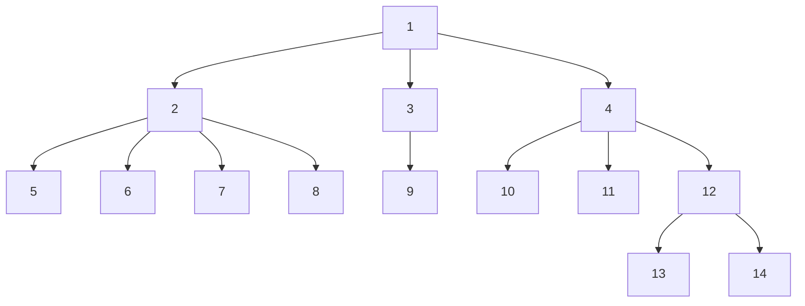

# Graph 3
[[graphs_1|Part 1]] and [[graphs_2|Part 2]]

# Euler Path/Circuit.
Euler path/circuit is a sequence of path chosen such that traversal makes use of each edge only once. There is an easy way to determine whether there is a graph $G$ that has Euler Path/Circuit.

## Euler Circuit.
For each in-edge for a vertex $v$, there should be an outgoing edge as well: i.e., the degree $D(v)$ of each vertex should be even (i.e, $D(u)\equiv\ 0\pmod{2}$).

The above results is for a undirected graph. If the graph is directed, then in-degree (say $D_i(u)$) should be the same as out-degree (say $D_o(u)$).

This is a circuit since after using each edge, we end up back to same starting vertex.

## Euler Path.
In certain cases, the condition occurs such that even though each edge is chosen exactly once, there is no circuit formed. This is possible when:
- For a undirected graph $G$, $\exists_{=1}\ v\in V, D(v)\equiv 1\pmod{2}$ (denotes there exists one and only one vertex that has an odd degree).
- For a directed graph $G$, $\exists_{=1}v\in\ V, D_{out}(u)-D_{in}(u)=1$. (denotes there is one extra outgoing edge than an incoming edge). 

In both cases, to create an euler path, this vertex $v$ is chosen as the starting point of the traversal: and each edge is added to the traversal.

# Lowest Common Ancestor
In a given [[trees|tree]] $G$, we have queries of form $(v_1, v_2)$, where $v_1\in V, v_2 \in V$, and we need to find the shortest path between $v_1$ and $v_2$: or a lowest vertex that is parent of both of these vertices.

For a given graph with tree rooted at $1$, 


We traverse an array similar to inorder traversal, except that each time we jump from one to another node, we store the record of it.

Assume that array is $I$. The below array shows the node values (top ones, say $I_1$) with the depth (bottom ones, say $I_2$).

$$
I=\left\{\begin{array}{cl}
1&2&5&2&6&2&7&2&8&2&1&3&9&3&1&4&10&4&11&4&12&13&12&14&12&4&1\\
1&2&3&2&3&2&3&2&3&2&1&2&3&2&1&2&3&2&3&2&3&4&3&4&3&2&1
\end{array}\right\}
$$
The size of this array $I$ would be exactly $2\cdot n-1$.

### Proof for $|I|=2\cdot n-1$.
For each edge $e$, we traverse from $u\rightarrow v$ and record $v$: and at some point for the same edge, we return back to $v\rightarrow u$ and record $u$. $\implies$ We use this edge $2$ times to record $2$ vertices. 

In tree of $n$ nodes, since number of edges in $n-1$, total node records would be  $2\cdot (n-1)=2\cdot n-2$. 

In addition, we also store the root node at the beginning before starting the traversal. This makes the array size $2\cdot n-1$ size. (Relevance: evaluate space and time complexity)

### Solving $lca(u,v)$ where $u$ and $v$ are vertices and $u,v\in V$. 
For a given two vertex $u$ and $v$ for the query, we find the first occuring value in array $I_1$ (say $I_{1x}$ and $I_{1y}$).  we find the lowest value between index $x$ and $y$ such that:

$$
lca(u,v)=I_{1,p},\quad \text{where } p=\min\limits_{m=x}^yI_{2,m}=I_{2,p}\quad p\text{ is an index having minimum depth}
$$

for e.g., for $u=5,v=8,\ lca(5,8)=2$. Similarly, $lca(8,10)=1,\ lca(10,14)=4,\ lca(4, 14)=4$.

```cpp
/**
 * @brief Query for Lowest Common Ancestor
 * 
 * @param tree Tree graph
 * @param root root of the tree denoting starting node of the traversal
 * @param queries List of queries: given two vertices u and v
 * @return vector<int> List of answer queries
 */
vector<int> queries_for_lca(vector<vector<int>>&tree, int root, const vector<pair<int, int>>&queries) {
    vector<int> answers;
    vector<bool> visited(tree.size(), false);
    vector<int> left(tree.size(), -1), height(tree.size(), 0);
    
    /**
     * @brief Generate traversal graph, and construct an inorder traversal of n-ary tree
     * except that the traversal after visiting all sub tree, we insert
     * the current node again.
     * 
     * @param vertex current vertex
     * @param prev_vertex previous vertex
     * @param depth depth at which the current node is
     * @param lca array denoting the construction of inorder traversal
     * @param visited marker for visibility of vertex
     * @returns bool returns true if there is no cycle
     */
    function<bool (int, int, int, vector<pair<int, int>>&, vector<bool>&)> traverse_graph = 
        [&traverse_graph, &tree, &left, &height](int vertex, int prev_vertex, int depth, vector<pair<int, int>>&lca, vector<bool>&visited) {
        if (left[vertex] == -1) {
            left[vertex] = lca.size();
        }
        lca.push_back({vertex, depth});
        height[vertex] = depth;

        for (auto &next_vertex: tree[vertex]) {
            if (prev_vertex != next_vertex) {
                if(traverse_graph(next_vertex, vertex, depth + 1, lca, visited)) {
                    lca.push_back({vertex, depth});
                } else {
                    return false;
                }
            }
        }
        return true;
    };

    vector<pair<int, int>>lca;
    if (traverse_graph(root, -1, 1, lca, visited)) {
        vector<int>seg_tree(lca.size() - 1, 0);
        seg_tree.insert(seg_tree.end(), lca.begin(), lca.end());

        for (int i = lca.size() - 2; i >= 0; --i) {
            int left = seg_tree[2*i+1], right = seg_tree[2*i+2];
            seg_tree[i] = height[left] > height[right] ? right : left;
        }
        for (auto &[u, v]: queries) {
            int iu = left[u], iv = left[v];
            iu += lca.size() - 1, iv += lca.size() - 1;
            if (iu > iv) {
                tie(iu, iv) = make_tuple(iv, iu);
            }

            int mn = height[seg_tree[iu]];
            int ans = seg_tree[iu];
            for (; iu <= iv;) {
                if (!(iu & 1)) {
                    if (mn > height[seg_tree[iu]]) {
                        ans = seg_tree[iu];
                        mn = height[seg_tree[iu]];
                    }
                    ++iu;
                }
                if ((iv & 1)) {
                    if (mn > height[seg_tree[iv]]) {
                        ans = seg_tree[iv];
                        mn = height[seg_tree[iv]];
                    }
                    --iv;
                }
                --iu;
                iu >>= 1;
                --iv;
                iv >>= 1;
            }

            answers.push_back(ans);
        }
    }

    return answers;
}
```

### Complexity
**Time Complexity**: Given stages:
- Pre-processing: $O(n)$
- Build [[segment_tree_1|segment tree]]: $O(n)$
- Solving all queries: $O(q\cdot \log_2{n})$.
This makes complexity $O(n+q\cdot \log_2{n})$.

**Space Complexity**: We require:
- Array $I$ of size $2\cdot n-1\equiv O(n)$.
- Segment tree of size $2\cdot |I|-1=4\cdot n-3\equiv O(n)$.
Overall complexity is $O(n)$.