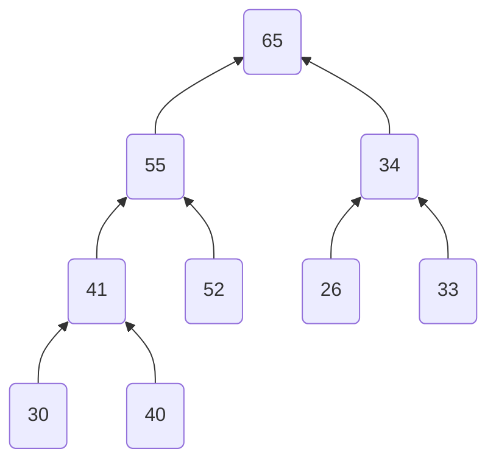

# Heaps.
Heaps are a non-linear data structure, typically stored in a linear data structure.



Given example is a binary heap which follows a certain rules with parent-child.
These values are stored in [[arrays_1d#In non-linear fashion|arrays]]. 
$$
A=\begin{array}{cl}
[65&55&34&41&52&26&33&30&40]
\end{array}
$$
# Binary Heap

The parent of this binary heap at $i^{th}$ index is defined as:
$$
p(i) = \left\{
\begin{array}{cl}
\left\lfloor\dfrac{i}{2}\right\rfloor, & \quad \textrm{a is 1-indexed array}\\
\left\lfloor\dfrac{i-1}{2}\right\rfloor, & \quad \textrm{a is 0-indexed array}
\end{array}
\right.
$$
It's children are $\{2\cdot i, 2\cdot i+1\}$ for 1-indexed array, $\{2\cdot i+1, 2\cdot i+2\}$ for 0-indexed. It's a complete binary [[trees|trees]].

An element at an index $i$ has to have a certain rule to follow to stay at that place, otherwise necessary steps are taken to adjust the heap.

There are two types of binary heaps that are common in nature:
1. Min heap: (Value of a parent is smaller than their child)
2. Max heap: (Opposite of what min heap is).

Although these are the common usage, the heap should not be limited to the values only. Attributes of the values can be considered as well: (e.g., set bits of an integer, a generator function $f(n)$).

Below class handles heap function with $0$-indexed array, with a user-defined comparison operator.

```python
class heap:
    """
    Generalize binary heap, arranges elements according to the 
    comparison operator, by default initializes max heap.
    """
    def __init__(self, comparison_operator):
        self.heap_array = []
        if comparison_operator is not None:
            self.comparison_operator = comparison_operator
        else:
            # default max heap
            self.comparison_operator = lambda root, child: root >= child

    def push(self, item):
        """
        Pushes an element `item` into the heap.
        """
        # subsitution for high performance
        ha, co = self.heap_array, self.comparison_operator
        ha.append(item)
        last_index = len(ha) - 1
        # rearrange the added element such the parent-children condition should be satisfied.
        # so swap until the parent-child is not satisfied.
        while last_index and not(co(ha[(last_index - 1) // 2], ha[last_index])):
            ha[last_index], ha[(last_index - 1)//2] = ha[(last_index - 1)//2], ha[last_index]
            last_index = (last_index - 1) // 2

    def heapify(self):
        """
        Used after popping off element from the heap.
        Rearrangement is done when a last element in the heap is put at the 
        top of the heap.

        Swapping is done in this stage, until the heap stage is satisfied:
        - A child is selected that can be the parent of root and another sibling
        - Swap these elements.
        - Repeat this process till such child is not found, or the root element follows
        condition.
        """
        i = 0
        # substituting references for better performance
        ha, co = self.heap_array, self.comparison_operator
        # Follow this condition till the last of heap.
        while 2*i + 1 < len(ha):
            left, right = 2 * i + 1, 2 * i + 2
            # if there is no right child.
            if right == len(ha):
                if not(co(ha[i], ha[left])):
                    ha[i], ha[left] = ha[left], ha[i]
                    i = left
                else:
                    break
            elif right < len(ha):
                # check whether 'left' is correct for both root and
                # sibling
                if co(ha[left], ha[right]):
                    if not(co(ha[i], ha[left])):
                        ha[i], ha[left] = ha[left], ha[i]
                        i = left
                    else:
                        break
                elif not(co(ha[i], ha[right])):
                    ha[i], ha[right] = ha[right], ha[i]
                    i = right
                else:
                    break
            else:
                break

    def pop(self):
        """
        Pop element from heap: rearranges all element according to the comparator 
        """
        if len(self.heap_array) == 0:
            return None
        self.heap_array[0], self.heap_array[-1] = self.heap_array[-1], self.heap_array[0]
        item_to_return = self.heap_array.pop()
        self.heapify()
        return item_to_return

    def top(self):
        """
        Returns the top of the heap array.
        returns none if heap array is empty
        """
        if self.heap_array:
            return self.heap_array[0]
        return None

    def __len__(self):
        """
        Length of heap array
        """
        return len(self.heap_array)

    def __str__(self):
        """
        Print heap
        """
        return '<heap> %s ' % str(self.heap_array)

```

Push/pop complexity: $O(\log_2{n})$ 

### Applications:
Anything that has to do with **retrieving lowest/highest matching criteria in collection in shortest amount of time**. This includes:
- Sorting an array (heap sort in $O(n\cdot \log_2{n})$).
	- [ ] To do 
- Implement a priority queue (retrieve highest priority value in $O(\log_2{n})$):
	- [x] Implementation is done above
- Return $k^{th}$ largest/smallest element from an array. Takes $O(k\cdot \log_2{n})$.
- Modified Dijkstra / Prim's algorithm for finding lowest distance vertex: $O((|V|+|E|)\cdot \log_2{|V|})$.
- Merge $k$-sorted list into one list: $O\left(\left(\sum\limits_{i=1}^{k}|L_i|\right)\cdot \log_2{k}\right)$. This is an online algorithm if incoming input stream are in ascending order (Here $|L_i|$ is the size of $i^{th}$ list).

# Fibonacci Heap
