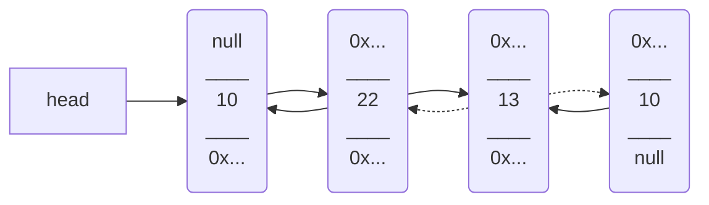
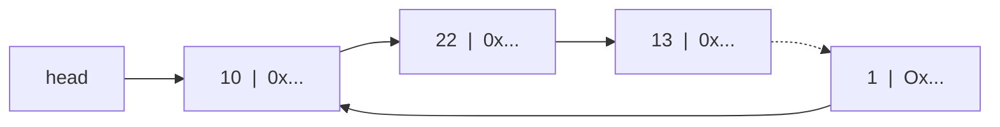
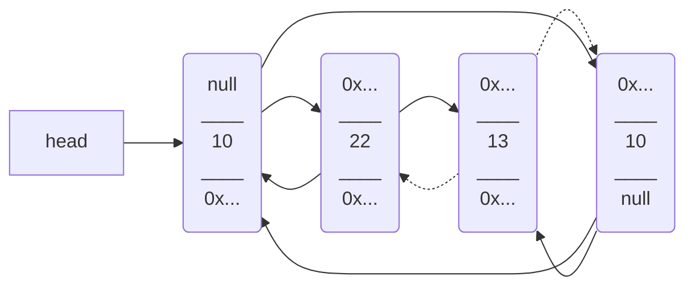

# Linked List observations 
Each of these lists have an address to start off from called as "head of the list."
# Different types of #linkedlist:
## Singly Linked List
#Singlylinkedlist contains only one link to a node, once this link is used to get to different node, you have to start the traversal from the start again.


### Code
```python
class node:
    """
    Node for singly linked list
    """
    def __init__(self, data=None):
        self.data, self.next = data, None

    def __str__(self) -> str:
        """
        Print the nodes.
        """
        return '{}{}'.format(self.data, ' -> ' if self.next is not None else '')

class singly_linked_list:
    """
    Singly linked list
    """
    def __init__(self):
        """
        Initialize the singly linked list
        """
        self.start_node, self.size = None, 0

    def __repr__(self):
        """
        Print all the nodes.
        """
        string, traverse = '', self.start_node
        while traverse.next is not None:
            string += traverse.__str__()
            traverse = traverse.next
        return string + traverse.__str__()

    def __str__(self) -> str:
        """
        Print all the nodes.
        """
        string, traverse = '', self.start_node
        while traverse.has_next():
            string += traverse.__str__()
            traverse = traverse.next
        return string + traverse.__str__()
    
    def __iadd__(self, data):
        """
        Add at the end
        >>> a = singly_linked_list()
        >>> a += 2
        >>> a += 4
        >>> a
        2 -> 4
        >>> a += 3
        >>> a += 6
        >>> a
        2 -> 4 -> 3 -> 6
        """
        new_node = node(data)
        traversal_node = self.start_node
        if traversal_node is None:
            self.start_node = new_node
            return self
        while traversal_node.next is not None:
            traversal_node = traversal_node.next
        traversal_node.next = new_node
        self.size += 1
        return self

    def insert_at(self, data, pos=None) -> None:
        """
        Inserts data at a certain position.
        >>> a = singly_linked_list()
        >>> a += 2
        >>> a += 4
        >>> a
        2 -> 4
        >>> a += 3
        >>> a += 6
        >>> a
        2 -> 4 -> 3 -> 6
        >>> a.insert_at(5, 3)
        >>> a
        2 -> 4 -> 5 -> 3 -> 6
        >>> a.insert_at(1, 2)
        >>> a
        2 -> 1 -> 4 -> 5 -> 3 -> 6
        """
        if pos is None or pos > self.size:
            self += data
            return
        traverse_node = self.start_node
        if traverse_node is None:
            self.start_node = node(data)
        if pos <= 2:
            new_node = node(data)
            if pos <= 1:
                new_node.next = self.start_node
                self.start_node = new_node
            else:
                temp = self.start_node.next
                self.start_node.next = new_node
                new_node.next = temp
        else:
            while traverse_node.next is not None and pos > 2:
                traverse_node = traverse_node.next
                pos -= 1
            if traverse_node == self.start_node:
                new_node = node(data)
                new_node.next = traverse_node
                self.start_node = new_node
            else:
                temp = traverse_node.next
                new_node = node(data)
                new_node.next = temp
                traverse_node.next = new_node

    def delete_at(self, pos=None) -> None:
        """
        Deletes the node at position `pos`. Returns none.
        Inserts data at a certain position.
        >>> a = singly_linked_list()
        >>> a += 2
        >>> a += 4
        >>> a += 3
        >>> a += 6
        >>> a.insert_at(5, 3)
        >>> a.insert_at(1, 6)
        >>> a
        2 -> 4 -> 5 -> 3 -> 6 -> 1
        >>> a.delete_at(2)
        >>> a
        2 -> 5 -> 3 -> 6 -> 1
        >>> a.delete_at(1)
        >>> a
        5 -> 3 -> 6 -> 1
        >>> a.delete_at(4)
        >>> a
        5 -> 3 -> 6
        """
        if pos is None:
            return

        if pos == 1:
            temp = self.start_node
            self.start_node = self.start_node.next
            temp.next = None
            del temp
        else:
            traverse_node, previous_node = self.start_node, None

            while pos >= 2 and traverse_node is not None:
                previous_node = traverse_node
                traverse_node = traverse_node.next
                pos -= 1

            if traverse_node is None:
                return

            previous_node.next = traverse_node.next
            traverse_node.next = None
            del traverse_node

if __name__ == '__main__':
    from doctest import testmod
    testmod()
```

## Doubly Linked List:
#doublylinkedlist
These have two links to coming to and from the nodes


## Circular Singly Linked List
#circularlinkedlist
Similar to linked list except that the last node is connected to first node



### Code
```python
class node:
    """
    Node for singly linked list
    """
    def __init__(self, data=None):
        self.data, self.next = data, None

    def __str__(self) -> str:
        """
        Print the nodes.
        """
        return '{}{}'.format(self.data, ' -> ' if self.next is not None else '')

class circular_singly_linked_list:
    """
    Singly linked list
    """
    def __init__(self):
        """
        Initialize the circular singly linked list
        """
        self.start_node, self.size = None, 0

    def __repr__(self):
        """
        Print all the nodes.
        """
        string, traverse = '', self.start_node
        while traverse.next != self.start_node:
            string += traverse.__str__()
            traverse = traverse.next
        return string + traverse.__str__()

    def __str__(self) -> str:
        """
        Print all the nodes.
        """
        string, traverse = '', self.start_node
        while traverse.next != self.start_node:
            string += traverse.__str__()
            traverse = traverse.next
        return string + traverse.__str__()
    
    def __iadd__(self, data):
        """
        Add at the end
        >>> a = circular_singly_linked_list()
        >>> a += 2
        >>> a += 4
        >>> a
        2 -> 4 -> 
        >>> a += 3
        >>> a += 6
        >>> a
        2 -> 4 -> 3 -> 6 -> 
        """
        new_node = node(data)
        traversal_node = self.start_node
        if traversal_node is None:
            self.start_node = new_node
            self.start_node.next = self.start_node
            return self
        while traversal_node.next != self.start_node:
            traversal_node = traversal_node.next
        traversal_node.next = new_node
        new_node.next = self.start_node
        self.size += 1
        return self

    def insert_at(self, data, pos=None) -> None:
        """
        Inserts data at a certain position.
        >>> a = circular_singly_linked_list()
        >>> a += 2
        >>> a += 4
        >>> a
        2 -> 4 -> 
        >>> a += 3
        >>> a += 6
        >>> a
        2 -> 4 -> 3 -> 6 -> 
        >>> a.insert_at(9, 2)
        >>> a
        2 -> 9 -> 4 -> 3 -> 6 -> 
        >>> a.insert_at(5, 3)
        >>> a
        2 -> 9 -> 5 -> 4 -> 3 -> 6 -> 
        >>> a.insert_at(1, 6)
        >>> a
        2 -> 9 -> 5 -> 4 -> 3 -> 6 -> 1 -> 
        """
        if pos is None or pos > self.size:
            self += data
            return
        traverse_node = self.start_node
        if traverse_node is None:
            self.start_node = node(data)
            self.start_node.next = self.start_node
        else:
            if pos <= 2:
                new_node = node(data)
                if pos <= 1:
                    new_node.next = self.start_node
                    self.start_node = new_node
                else:
                    temp = self.start_node.next
                    self.start_node.next = new_node
                    new_node.next = temp
            else:
                while traverse_node.next != self.start_node and pos > 2:
                    traverse_node = traverse_node.next
                    pos -= 1
                if traverse_node == self.start_node:
                    new_node = node(data)
                    new_node.next = traverse_node
                    self.start_node = new_node
                else:
                    temp = traverse_node.next
                    new_node = node(data)
                    new_node.next = temp
                    traverse_node.next = new_node

    def delete_at(self, pos=None) -> None:
        """
        Deletes the node at position `pos`. Returns none.
        Inserts data at a certain position.
        >>> a = circular_singly_linked_list()
        >>> a += 2
        >>> a += 4
        >>> a += 3
        >>> a += 6
        >>> a.insert_at(5, 3)
        >>> a.insert_at(1, 6)
        >>> a
        2 -> 4 -> 5 -> 3 -> 6 -> 1 -> 
        >>> a.delete_at(2)
        >>> a
        2 -> 5 -> 3 -> 6 -> 1 -> 
        >>> a.delete_at(1)
        >>> a
        5 -> 3 -> 6 -> 1 -> 
        >>> a.delete_at(4)
        >>> a
        5 -> 3 -> 6 -> 
        """
        if pos is None:
            return

        if pos == 1:
            # Circular linked list of size 1
            if self.start_node == self.start_node.next:
                self.start_node.next = None
                del self.start_node
            else:
                # Last node should be linked to new start node
                traverse = self.start_node
                while traverse.next != self.start_node:
                    traverse = traverse.next
                temp = self.start_node
                self.start_node = temp.next
                temp.next = None
                traverse.next = self.start_node
                del temp
        else:
            # delete from any middle position
            traverse_node, previous_node = self.start_node, None

            while pos >= 2 and traverse_node.next != self.start_node:
                previous_node = traverse_node
                traverse_node = traverse_node.next
                pos -= 1

            if traverse_node == self.start_node:
                return

            previous_node.next = traverse_node.next
            traverse_node.next = None
            del traverse_node
```

## Circular Doubly Linked List.
Similar to Doubly Linked List but both of their ends are linked to each other.



#circulardoublylinkedlist
