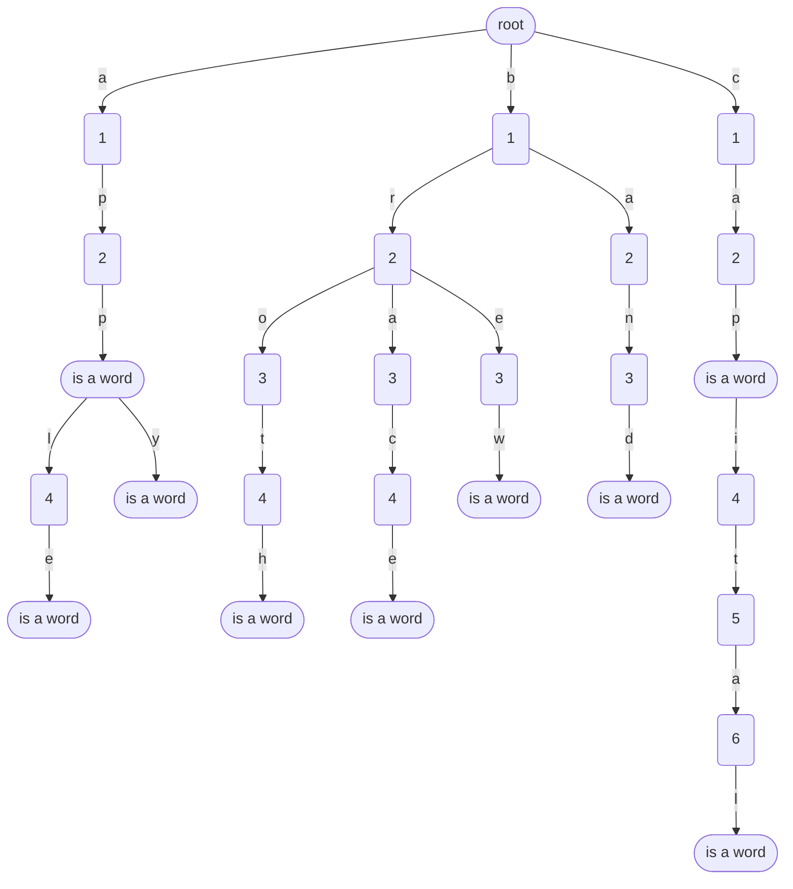

# Trie / Prefix tree
For a list of dictionary

```json
["apple", "browse", "apply", "broth", "brace", "brew", "band", "app", "cap", "capital"]
```

A trie is generated as follows:



Here, rounded nodes are terminal nodes denoting that path from root to the rounded node is a word in a dictionary.

### Searching in a trie:
Refer to `__contains__` in python code.

```python
class trie_node:
    """
    Node for a trie
    """
    def __init__(self, is_a_word=False):
        self.is_a_word = is_a_word
        self.next_alphabet = {}

class trie:
    """
    Trie stores a prefix tree
    >>> a = trie(); a += "apple"; a += "application"; a += "apply"; a += "baseball"; a += "bases"; a += 'acid'; [x in a for x in ["applicati", "apply", "apple", "baseball", "base", "acid"]]; a.starts_with('base')
    [False, True, True, True, False, True]
    True
    >>> a = trie(); a += "apple"; a += "application"; a += "apply"; a += "baseball"; a += "bases"; a += 'acid'; a.suggest('a')
    ['acid', 'apply', 'application', 'apple']
    >>> a = trie(); a += "apple"; a += "application"; a += "apply"; a += "baseball"; a += "bases"; a += 'acid'; a.suggest('app')
    ['apply', 'application', 'apple']
    """
    
    def __init__(self):
        """
        Constructor for trie
        """
        self.root_node = trie_node()

    def __iadd__(self, string: str):
        """
        Add the value to itself.
        """
        traversal_node, i = self.root_node, 0
        while i < len(string):
            if string[i] not in traversal_node.next_alphabet:
                new_trie_node = trie_node()
                traversal_node.next_alphabet[string[i]] = new_trie_node
            traversal_node = traversal_node.next_alphabet[string[i]]
            i += 1
        traversal_node.is_a_word = True
        return self

    def __contains__(self, string: str) -> bool:
        """
        Check if the string is in trie
        """
        traversal_node, i = self.root_node, 0
        while i < len(string):
            if string[i] in traversal_node.next_alphabet:
                traversal_node = traversal_node.next_alphabet[string[i]]
            else:
                return False
            i += 1
        return traversal_node.is_a_word

    def starts_with(self, string: str) -> bool:
        """
        Checks whether there is at least one string starting with 
        the mentioned str
        """
        traversal_node, i = self.root_node, 0
        while i < len(string):
            if string[i] in traversal_node.next_alphabet:
                traversal_node = traversal_node.next_alphabet[string[i]]
            else:
                return False
            i += 1
        return traversal_node is not None

    def suggest(self, string: str) -> bool:
        """
        Auto suggest list of words in the prefix tree.
        >>> a = trie()
        >>> for x in ['apple', 'browse', 'apply', 'broth', 'brace', 'brew', 'band', 'app', 'cap', 'capital', 'cast', 'cascade', 'cellphone']:
        ...     a += x
        >>>
        >>> a.suggest('app')
        ['app', 'apply', 'apple']
        >>> a.suggest('b')
        ['band', 'brew', 'brace', 'broth', 'browse']
        >>> a.suggest('c')
        ['cellphone', 'cascade', 'cast', 'cap', 'capital']
        >>> a.suggest('ca')
        ['cascade', 'cast', 'cap', 'capital']
        >>> a.suggest('ce')
        ['cellphone']
        """
        traversal_node, i = self.root_node, 0
        while i < len(string):
            if string[i] in traversal_node.next_alphabet:
                traversal_node = traversal_node.next_alphabet[string[i]]
            else:
                return False
            i += 1
        answer, stack = [], []
        if traversal_node is not None:
            stack = [(traversal_node, string)]
            while stack:
                vertex, suggest = stack.pop()
                if vertex.is_a_word:
                    answer.append(suggest)
                if len(vertex.next_alphabet):
                    stack.extend([(node, suggest+char) for char, node in vertex.next_alphabet.items()])
        return answer

if __name__ == "__main__":
    from doctest import testmod
    testmod()
```