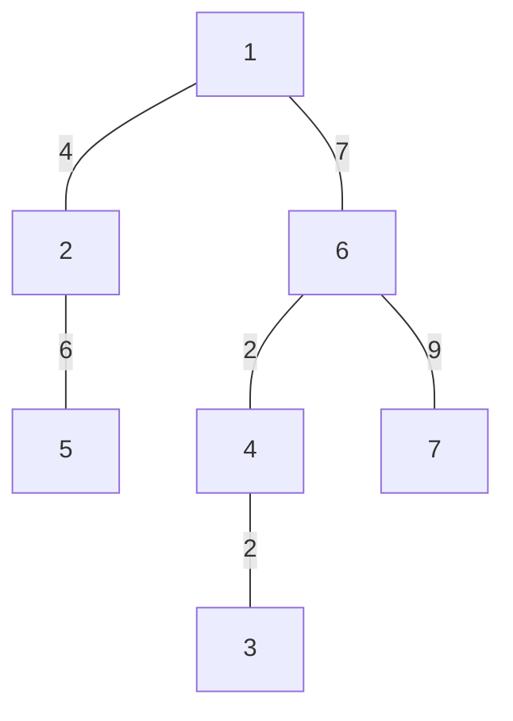
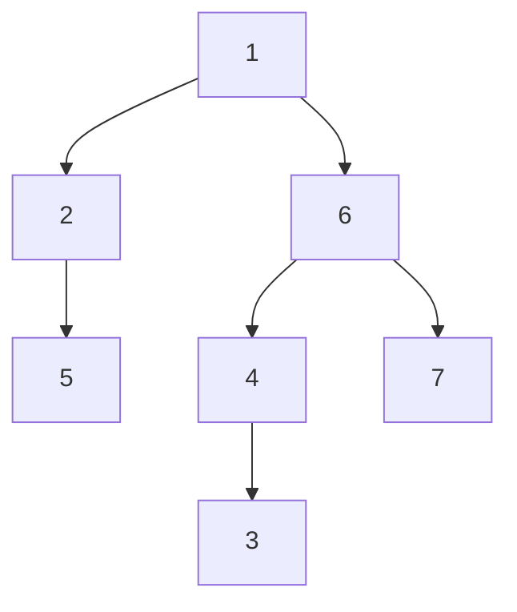
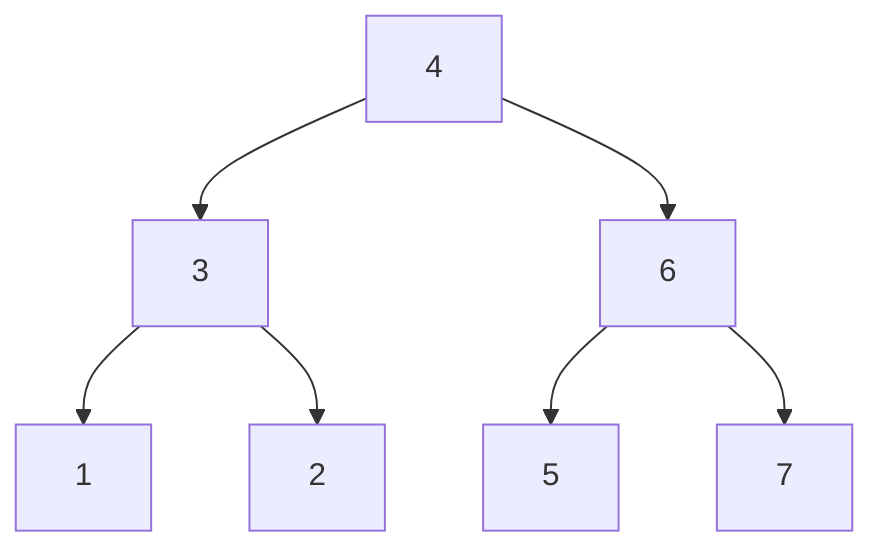

# Trees
```ad-important
General operations is implemented in `tree.py` file.
```

Trees are a type of [[graphs_1#Sparse Matrix|graphs]] $G=(E,\ V)$, with some special properties.

1. $|E|=|V|-1$ (There are exactly $n-1$ edges in graph) and
2. It's [[graphs_1#Connected Graphs|connected]].

Here $|S|$ is the size of set $S$.


Corollaries:
1. $G$ is connected, and is minimum graph for reachability from each vertex to a different one. i.e., 
2. If any one edge is added, a cycle in graph will form and the definition of tree would fail.
3. If any one edge is removed, the graph would be divided in two subgraphs.
4. Let $P(u,v)=$ set of paths from vertex $u$ to $v$, then $\forall\ (u,v)\in V, |P(u,v)|=1$. (i.e., there exists only one path for each pair of vertex from $u$ to $v$).
5. These are [[graphs_1#Bi-partite graphs|bi-partite]] graphs, since they don't have cycle, they can be divided easily into alternate sets $U$ and $V$ respectively.


#### [Properties](https://en.wikipedia.org/wiki/Binary_tree)
*Note*: Height starts from root node, which is defined $0$.
- A perfect binary tree is called as tree having two childrens and each of the leaves are at the same level. $\implies$ node at level $n$ contains $2^{n-1}$ nodes, and total nodes in a tree are $2^n-1$.
- A full binary tree is called as tree having either $0$ or $2$ children. The results for this is: if there are $n$ leaf nodes, then there are $n-1$ non-leaf nodes.
- A complete binary tree is a kind of tree where every level (except last level) is completely filled. If there are $n$ nodes in total, then number of internal nodes $=\left\lfloor\dfrac{n}{2}\right\rfloor$.
- A balanced tree is defined as the tree in which height difference between left and right subtrees differs by at max $1$. For this, height of balanced tree = $\left\lceil\log_2(n+1)\right\rceil$.
- A binary tree of height $h$ contains at least ${h+1}$ nodes, and at max $2^{h+1}-1$ nodes.
- A **full** binary tree of height $h$ contains at least $2h+1$ nodes and at max $2^{h+1}-1$
# Binary Trees.
Binary trees are a special kind of trees with **at most two** child links. It contains a hierarchy starting from a node called the root of the tree.


We consider root $1$ with children $2$ and $6$, having their own respective child nodes $5$ and $\{4, 7\}$.

# Storing these values

These are denoted by linking as:

```python
class tree_node:
    """
    A tree node that contains data, and references to
    two other similar nodes, by left and right value
    """
    def __init__(self, data=None):
        self.data, self.left, self.right = data, None, None
```

Another method to store them is in [[arrays_1d#In non-linear fashion|arrays]]:

Currently, there seems to be only one relation between the nodes: there is a root node and each node might contain children.

# Binary Search Trees.
Binary Search Trees have a special characteristics, the left subtree has values $<$ current node value and right subtree $>$ current node.


## Tree traversals
There are mainly three types of tree traversals:
### Pre-order traversal
The order for pre-order traversal from root $v$ in graph $G$ is current node, left node, and right node ($op$ here is user's desired operation).

$$
pre(v)=\left\{
\begin{array}{cl}
-,&\not\exists\ v\\
op(v),\ pre(v\rightarrow L),\ pre(v\rightarrow R),&\exists\ v\in V
\end{array}
\right.
$$
```python
def preorder(root_node):
    """
    Preorder traversal of a binary tree
    """
    if root_node is not None:
        print(root_node.data)
        preorder(root_node.left)
        preorder(root_node.right)
```
For the above tree: the nodes will be processed in this order: $\begin{matrix}4&3&1&2&6&5&7\end{matrix}$.
### In-order traversal
$$
in(v)=\left\{
\begin{array}{cl}
-,&\not\exists\ v\\
pre(v\rightarrow L),\ op(v),\ pre(v\rightarrow R),&\exists\ v\in V
\end{array}
\right.
$$

```python
def inorder(root_node):
    """
    Inorder traversal of a binary tree
    """
    if root_node is not None:
        inorder(root_node.left)
        print(root_node.data)
        inorder(root_node.right)
```
For the above tree: the nodes will be processed in this order: $\begin{matrix}1&2&3&4&5&6&7\end{matrix}$.
### Post-order
$$
post(v)=\left\{
\begin{array}{cl}
-,&\not\exists\ v\\
post(v\rightarrow L),\ post(v\rightarrow R),\ op(v),&v\in V
\end{array}
\right.
$$
```python
def postorder(root_node):
    """
    Postorder traversal of a binary tree
    """
    if root_node is not None:
        postorder(root_node.left)
        postorder(root_node.right)
        print(root_node.data)
```
For the above tree: the nodes will be processed in this order: $\begin{matrix}1&3&2&5&7&6&4\end{matrix}$.
## Max-depth of a tree
A generalized approach for max depth using adjacency matrix is [[problem_reduction_1#memoization_2d_1 Longest Increasing Paths in a Grid https leetcode com problems longest-increasing-path-in-a-matrix Longest Increasing Path in a grid|solved here]]. For binary tree (general binary tree or BST), the solution for given vertex $v$ and their child $v\rightarrow L$ and $v\rightarrow R$ is:
$$
d(v)=\left\{
\begin{array}{cl}
0,&\not\exists\ v\\
1,&v\in V,\not\exists\ (v\rightarrow L,v\rightarrow R)\\
1+d(v\rightarrow L),&v\in V,v\rightarrow L\in V,\not\exists\ v\rightarrow R\\
1+d(v\rightarrow R),&v\in V,v\rightarrow R\in V,\not\exists\ v\rightarrow L\\
1+\max(d(v\rightarrow L), d(v\rightarrow R)),&v\in V,v\rightarrow L,v\rightarrow R\in V
\end{array}
\right.
$$

This is a simple algorithm that considers all the possibilities of children.


