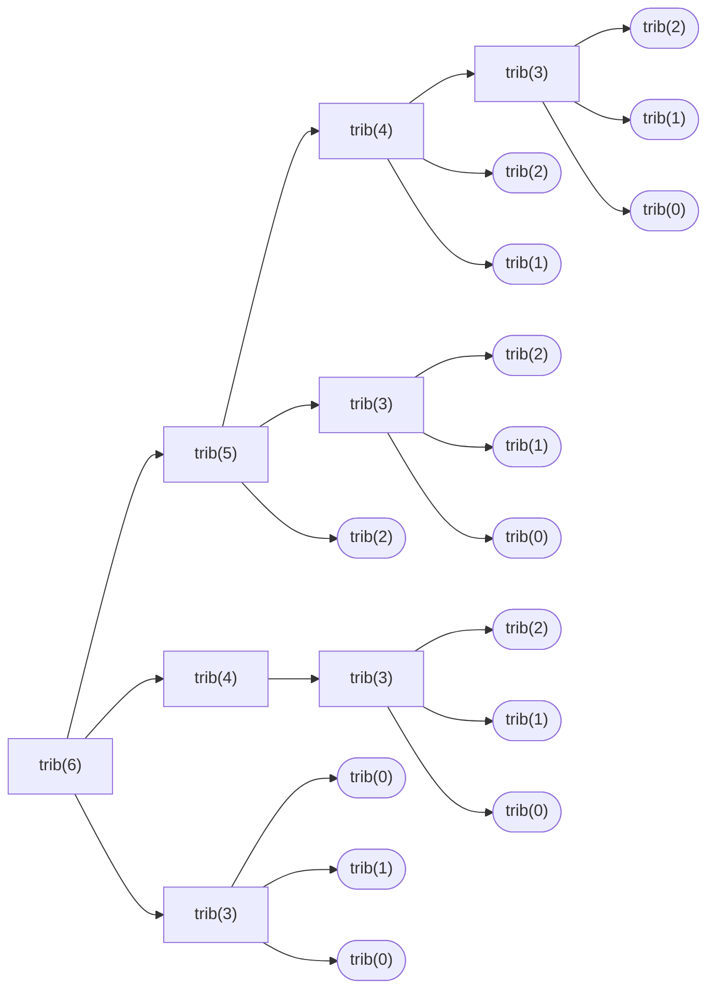

# Intermediate Maths for CS: Part 2 
[[intermediate_maths|See here for Part 1]]
## Linear Recurrence.
A relation where a term is evaluated depending on values of previous terms: 

$$
f(n) =
\left\{
	\begin{array} { c l }
	c_0, & \quad n = 0\\
	c_1, & \quad n = 1\\
	c_2, & \quad n = 2\\
	\vdots\\
	c_k, & \quad n = k\\
	a_0.\ f(n - 1) + a_1.\ f(n - 2) + a_2.\ f(n - 3) + ... + a_{k}.\ f(n - k), & \quad n > k
	\end{array}
\right.
$$

where $a_0,\ a_1,\ a_2,\ ...\ a_k, c_0,\ c_1,\ c_2,\ ...\ c_k \in \mathbb{R}$ (although these can be complex numbers $\mathbb{C}$ as well, but for simplicity we keep real numbers $\mathbb{R}$). 

As the length of the recurrence relation is $k$, the complexity of evaluating $f(n)$ would take an huge amount of time (of the order $O(k^n)$), since each of these calls would generate a k-ary tree.

E.g., For tribonacci series $trib(n) = trib(n-1) + trib(n-2) + trib(n-3)$, the tree for $n = 5$ would be 



We see that the tree expands at a huge rate, and $trib(4)$, $trib(3)$ is computed unnecessarily, making recursive solution inefficient. With memoization, the time can be reduced, but it is only viable for terms upto $n = 10^6$.
The worst-case complexity for recursive tribonacci is $O(3^n)$.

To evaluate $n^{th}$ term where $n$ is of the order $\geq 10^{12}$, [[matrix]] exponentiation can be used.
We use a matrix and multiply with the base case solution vector $n$ times.
E.g., For fibonacci (starting from $n = 0$):

$$
M = 
\begin{bmatrix}
0 & 1\\
1 & 1
\end{bmatrix},\  
B = \begin{bmatrix}
0 & 1
\end{bmatrix}
$$

$M$: matrix form, $B$: base case vector/matrix.

$$
\begin{matrix}
B.M & = &
	\begin{bmatrix}
	0 & 1
	\end{bmatrix}.
	\begin{bmatrix}
	0 & 1\\
	1 & 1
	\end{bmatrix}
& = &
	\begin{bmatrix}
	1 & 1
	\end{bmatrix}
\\
B.M^2 & = &
	\begin{bmatrix}
	0 & 1
	\end{bmatrix}.
	\begin{bmatrix}
	1 & 1\\
	1 & 2
	\end{bmatrix}
& = &
	\begin{bmatrix}
	1 & 2
	\end{bmatrix}
	\\
B.M^3 & = &
	\begin{bmatrix}
	0 & 1
	\end{bmatrix}.
	\begin{bmatrix}
	1 & 2\\
	2 & 3
	\end{bmatrix}
& = &
	\begin{bmatrix}
	2 & 3
	\end{bmatrix}
	\\
B.M^4 & = &
	\begin{bmatrix}
	0 & 1
	\end{bmatrix}.
	\begin{bmatrix}
	2 & 3\\
	3 & 5
	\end{bmatrix}
& = &
	\begin{bmatrix}
	3 & 5
	\end{bmatrix}
	\\
\vdots
\end{matrix}
$$

With this:

$$
B.M^{n} = 
\begin{bmatrix}
0 & 1
\end{bmatrix}.
\begin{bmatrix}
0 & 1\\
1 & 1
\end{bmatrix}^n = 
\begin{bmatrix}
f(n) & f(n+1)\\
\end{bmatrix},
$$

### Some examples for matrix construction:

#### Tribonacci Series

For tribonacci, the base matrix would be:

$$
f(n) = \left\{
\begin{array}{ c l }
0,&\quad n \in \{0,\ 1\}\\
1,&\quad n=2,\\
f(n-1)+f(n-2)+f(n-3),&\quad n>2,\ n\in\mathbb{N}
\end{array}
\right.
$$

The matrices will be:

$$
B = \begin{bmatrix}
0 & 0 & 1
\end{bmatrix}, 
\ M = 
\begin{bmatrix}
0 & 0 & 1\\
1 & 0 & 1\\
0 & 1 & 1
\end{bmatrix}
$$

$$
\begin{matrix}
B.M^n =
	\begin{bmatrix}
	0 & 0 & 1
	\end{bmatrix}
	\begin{bmatrix}
	0 & 0 & 1\\
	1 & 0 & 1\\
	0 & 1 & 1
	\end{bmatrix}^{n}
	& =
	\begin{bmatrix}
	f(n) & f(n+1) & f(n+2)
	\end{bmatrix}
\end{matrix}
$$

The matrix is constructed such that the last column would make the recurrence relation, and in the left-lower $(n-1)\times(n-1)$ matrix, the diagonal is set to 1 to shift to next term when multiplying matrices.

#### Pell's Series/Recurrence relation
For pell recurrence relation:

$$
f(n) = 
\left\{
\begin{array}{ c l }
n, & \quad n \in \{0,\ 1\}\\
2\cdot f(n-1)+f(n-2),&\quad n>1
\end{array}
\right.
$$

the matrix for recurrence relation would be:

$$
B = \begin{bmatrix}
0 & 1
\end{bmatrix},\ \
M = \begin{bmatrix}
0 & 1\\
1 & 2
\end{bmatrix}
$$

#### Pell's recurrence, with a constant value.
If there are constants involved in the equation:

$$
f(n) = 
\left\{
\begin{array}{ c l }
n, & \quad n \in \{0,\ 1\}\\
2\cdot f(n-1) + f(n-2) + 7, & \quad n > 1
\end{array}
\right.
$$

The equivalent matrix form would be:

$$
B = \begin{bmatrix}
0 & 1 & 7
\end{bmatrix},\ \
M = \begin{bmatrix}
0 & 1 & 0\\
1 & 2 & 0\\
0 & 1 & 1
\end{bmatrix}
$$

With this, we can obtain next terms $f(n)\text{ for }n=1\rightarrow3$ as:

$$
\begin{matrix}
B.M & = &
	\begin{bmatrix}
	0 & 1 & 7
	\end{bmatrix}.
	\begin{bmatrix}
	0 & 1 & 0\\
	1 & 2 & 0\\
	0 & 1 & 1
	\end{bmatrix}
& = &
	\begin{bmatrix}
	1 & 9 & 7
	\end{bmatrix}
\\
B.M^2 & = &
	\begin{bmatrix}
	0 & 1 & 7
	\end{bmatrix}.
	\begin{bmatrix}
	1 & 2 & 0\\
	2 & 5 & 0\\
	1 & 3 & 1
	\end{bmatrix}
& = &
	\begin{bmatrix}
	9 & 26 & 7
	\end{bmatrix}
\\
B.M^3 & = &
	\begin{bmatrix}
	0 & 1 & 7
	\end{bmatrix}.
	\begin{bmatrix}
	2 & 5 & 0\\
	5 & 12 & 0\\
	3 & 8 & 1
	\end{bmatrix}
& = &
	\begin{bmatrix}
	26 & 68 & 7
	\end{bmatrix}
\\
\vdots
\end{matrix}
$$

$f(0) = 0, f(1) = 1,\ f(2) = 9,\ f(3) = 26,\ f(4) = 68,\ ...$ are the first five terms of the modified series.

#### Sum of first $n$ fibonacci series.

- For sum of first $n$ terms in recurrence series: (e.g., fibonacci series), let's suppose

$$
s(n) = \sum\limits_{i=0}^{n} f(i)
$$

$$
B = \begin{bmatrix}
s(1) & 0 & 1
\end{bmatrix} = \begin{bmatrix}
1 & 0 & 1
\end{bmatrix},\ 
M = \begin{bmatrix}
1 & 0 & 0\\
1 & 0 & 1\\
1 & 1 & 1
\end{bmatrix}
$$

The first three values of series sum:

$$
\begin{matrix}
B.M & = & \begin{bmatrix}
1 & 0 & 1
\end{bmatrix}
\begin{bmatrix}
1 & 0 & 0\\
1 & 0 & 1\\
1 & 1 & 1
\end{bmatrix} & = & \begin{bmatrix}
2 & 1 & 1
\end{bmatrix}\\\\
B.M^2 & = & \begin{bmatrix}
1 & 0 & 1
\end{bmatrix}
\begin{bmatrix}
1 & 0 & 0\\
2 & 1 & 1\\
3 & 1 & 2
\end{bmatrix} & = & \begin{bmatrix}
4 & 1 & 2
\end{bmatrix}\\\\
B.M^3 & = & \begin{bmatrix}
1 & 0 & 1
\end{bmatrix}
\begin{bmatrix}
1 & 0 & 0\\
4 & 1 & 2\\
6 & 2 & 3
\end{bmatrix} & = & \begin{bmatrix}
7 & 2 & 3
\end{bmatrix}\\
\vdots
\end{matrix}
$$

The sum is stored in the first position as $s(k)$, where $k$ is the sum of first base cases of recurrence relation.

In general, the matrix construction for finding $n^{th}$ terms (e.g., the first equation at the start of this section) is:

$$
B = \begin{bmatrix}
c_0&c_1&c_2&\cdots&c_k
\end{bmatrix}
$$

$$
M = 
\begin{bmatrix}
0 & 0 & 0 & \cdots & 0 & a_0 \\
1 & 0 & 0 & \cdots & 0 & a_1 \\
0 & 1 & 0 & \cdots & 0 & a_2 \\
0 & 0 & 1 & \cdots & 0 & a_3 \\
\vdots & \vdots & \vdots & \ddots & \vdots & \vdots\\
0 & 0 & 0 & \cdots & 1 & a_k
\end{bmatrix}
$$

Finding exponent for $k\times k$ matrix $M^n$ can be done in $O(\log_2(n))$ time ($n$: exponent) using [[basic_maths#Modular power function by Binary Exponentiation|binary exponent method]], where each matrix multiplication takes $O(k^3)$ time.

The overall complexity would be $O(k^3\cdot\log_2(n))$.

The current solution gives only $n^{th}$ term (without involving constants), but the above constant and sum adjustments can be done easily as mentioned before.

```python
def linear_recurrence(coefficient: list, base_cases: int, n: int, mod=0) -> int:
    """
    Evaluates the linear recurrence relation of the form:
    ```
    f(n) = a1. f(n - 1) + a2. f(n - 2) + ... + ak. f(n - k), n >= k
         = bi, i < k
    ```
    using matrix exponentiation in O(k^3 . log(n)):
    >>> [linear_recurrence([1, 1, 1], [0, 0, 1], i) for i in range(20)] # tribonacci, first 20 series
    [0, 0, 1, 1, 2, 4, 7, 13, 24, 44, 81, 149, 274, 504, 927, 1705, 3136, 5768, 10609, 19513]
    >>> [linear_recurrence([1, 2], [0, 1], i) for i in range(20)] # pell numbers, first 20 series
    [0, 1, 2, 5, 12, 29, 70, 169, 408, 985, 2378, 5741, 13860, 33461, 80782, 195025, 470832, 1136689, 2744210, 6625109]
    >>> [linear_recurrence([1, 1], [1, 2], i) for i in range(10)] # fibonacci with different initial values
    [1, 2, 3, 5, 8, 13, 21, 34, 55, 89]
    """
    def mat_mul(a: list, b: list, mod: int) -> list:
        """
        Matrix multiplication of two matrices
        """
        c = []
        rowl_a, coll_a, rowl_b, coll_b = len(a), len(a[0]), len(b), len(b[0])
        assert(coll_a == rowl_b)
        if mod == 0:
            for i in range(rowl_a):
                c += [[sum([a[i][k] * b[k][j] for k in range(rowl_b)]) for j in range(coll_b)]]
    
        else:
            c = [[0 for j in range(coll_b)] for i in range(rowl_a)]
            for i in range(rowl_a):
                for j in range(coll_b):
                    for k in range(rowl_b):
                        c[i][j] += a[i][k] * b[k][j]
                        c[i][j] %= mod
    
        return c

    def mat_expo(a: list, exponent: int, mod: int) -> int:
        """
        Matrix exponentiation, similar to mod_power function
        """
        # Identity matrix
        result = [[0 if i != j else 1 for i in range(len(a))] for j in range(len(a))]
        while exponent > 0:
            if exponent & 1:
                result = mat_mul(result, a, mod)
            a = mat_mul(a, a, mod)
            exponent >>= 1
        return result

    def construct_matrix(coefficient: int, base_cases: int) -> list:
        """
        Construct the matrix that evaluates the recurrence relation
        """
        k = len(base_cases)
        matrix = [[0 for i in range(k)] for j in range(k)]
        for x in range(1, k):
            matrix[x][x - 1] = 1
        for x in range(k):
            matrix[x][-1] = coefficient[x]
        return matrix
    
    mat = construct_matrix(coefficient, base_cases)
    mat_n = mat_expo(mat, n, mod)
    answer = mat_mul([base_cases], mat_n, mod)
    return answer[0][0]
```
